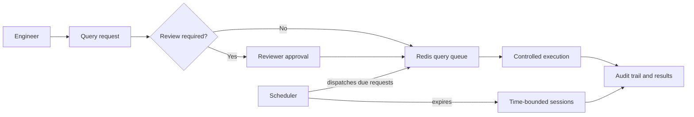

<p align="center">
  
</p>

<h1 align="center">Crucible DB</h1>

<p align="center">
  A governed control plane for reviewed, scheduled, and auditable database access.
</p>

<p align="center">
  <a href="https://github.com/adiwidia-dev/crucible-db/actions/workflows/tests.yml"></a>
  
  
  
</p>

Crucible DB gives engineering teams a safer path to production database work without distributing direct credentials. Every meaningful action moves through a visible control plane: access is scoped by role, sensitive work can be reviewed, execution can be scheduled or time-bounded, and activity is retained in an audit trail.

## Why Crucible DB?

- **Review before execution** — submit single SQL statements for review, approval, and asynchronous execution.
- **Time-bounded database access** — create controlled query sessions that automatically expire.
- **Clear accountability** — record requests, reviews, executions, session activity, and administrative actions.
- **Role-scoped connections** — grant users access to specific PostgreSQL and MySQL connections through roles and permissions.
- **Practical authentication** — support password login, invitations, passkeys, two-factor authentication, and Google, GitHub, or Microsoft sign-in.
- **Portable operations** — deploy the complete control plane as one application container plus Redis; application metadata is stored in a persistent SQLite volume.

## How it works



Crucible DB connects to the target database only to test a connection, inspect its schema, or execute an authorized request. It currently supports PostgreSQL and MySQL target connections.

## Quick start for contributors

### Prerequisites

- PHP 8.3 or later
- Composer 2
- Node.js 22
- Docker and Docker Compose (recommended for the full local stack)

### Native setup

```bash
composer setup
composer dev
```

The setup command installs PHP and JavaScript dependencies, creates the local environment file, generates an application key, runs migrations, and builds frontend assets.

### Docker development stack

```bash
docker compose up --build
```

The development Compose stack includes Crucible DB, Redis, Vite, and disposable PostgreSQL/MySQL targets for local testing. The application is available at `http://localhost:8000`.

## Production deployment

Production uses two persistent services:

```text
Crucible DB application
├─ FrankenPHP / Laravel Octane
├─ Laravel Horizon
└─ Laravel scheduler

Redis
├─ queues and Horizon metadata
├─ sessions
└─ cache
```

The production application image is published as `hephaestus/crucible-db:alpha`. A deployment directory needs only `compose.production.yaml` and a secure `.env.production` file—there is no need to clone the source repository or build the image on the server.

```bash
cp .env.production.example .env.production
```

Set a unique application key, public URL, and mail settings in `.env.production`. You can generate an application key with:

```bash
printf 'APP_KEY=base64:%s\n' "$(openssl rand -base64 32)"
```

Then start the stack:

```bash
docker compose -f compose.production.yaml up -d
```

On startup, the application waits for Redis, runs database migrations, and starts Octane, Horizon, and the scheduler under a process supervisor. Confirm it is healthy with:

```bash
curl --fail http://localhost:8000/health
```

For an update, pull and recreate the two services:

```bash
docker compose -f compose.production.yaml pull
docker compose -f compose.production.yaml up -d
```

## Quality checks

Run the full local verification suite with:

```bash
composer ci:check
```

This runs frontend linting, formatting, TypeScript checks, PHP formatting, PHPStan, and the PHPUnit suite.

## Documentation

- [Product overview](docs/product/overview.md)
- [Design direction](docs/product/design.md)
- [Architecture decisions](docs/architecture/decisions.md)
- [Historical plans](docs/archive/plans/)
- [Historical specifications](docs/archive/specifications/)

## Contributing

Issues and pull requests are welcome. Please keep changes focused, add or update tests for behavior changes, and run `composer ci:check` before opening a pull request.

## License

Crucible DB is licensed under the MIT License.
