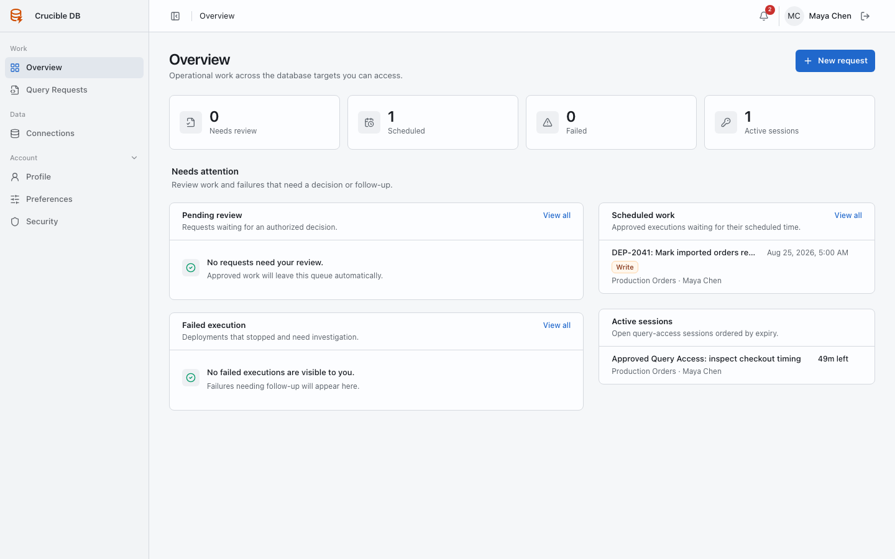
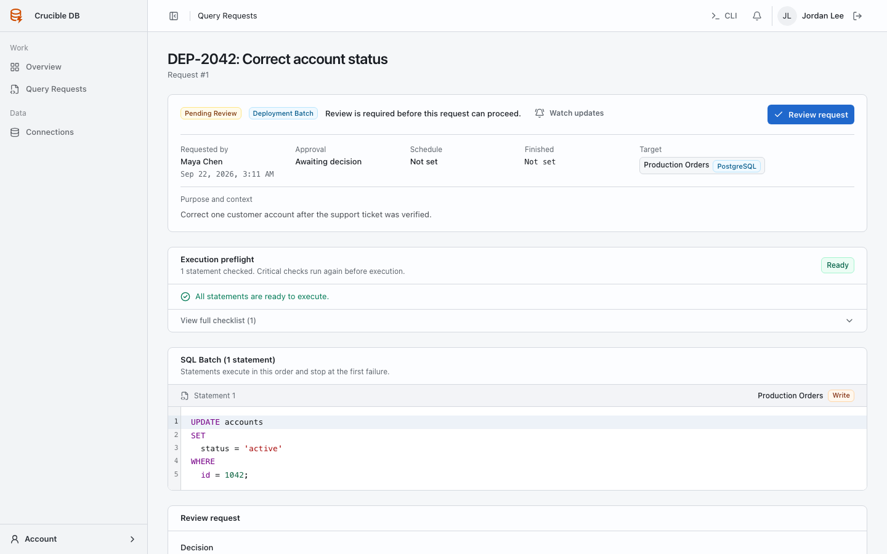
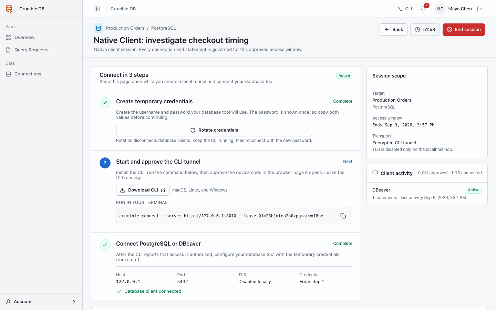
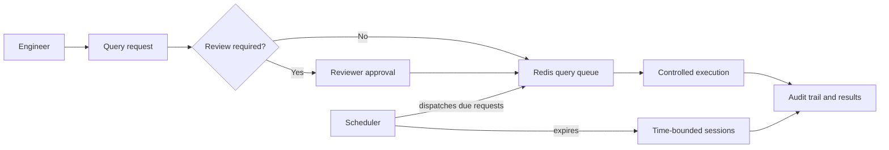

<p align="center">
  
</p>

<h1 align="center">Crucible DB</h1>

<p align="center">
  A governed control plane for reviewed, scheduled, and auditable database access.
</p>

<p align="center">
  <a href="https://adiwidia-dev.github.io/crucible-db/"><strong>Read the documentation</strong></a>
  ·
  <a href="https://github.com/adiwidia-dev/crucible-db/releases/latest"><strong>View the latest release</strong></a>
</p>

<p align="center">
  <a href="https://github.com/adiwidia-dev/crucible-db/actions/workflows/tests.yml"></a>
  <a href="https://github.com/adiwidia-dev/crucible-db/releases/tag/v0.2.1"></a>
  <a href="https://adiwidia-dev.github.io/crucible-db/"></a>
  
  
  
</p>

Crucible DB gives engineering teams a safer path to production database work without distributing direct credentials. Every meaningful action moves through a visible control plane: access is scoped by role, sensitive work can be reviewed, execution can be scheduled or time-bounded, and activity is retained in an audit trail.

## Product tour

<p align="center">
  <a href="docs/assets/screenshots/user-overview.png">
    
  </a>
</p>

<p align="center">
  <sub><strong>Operational overview.</strong> Review work, scheduled executions, failures, and active sessions stay visible in one place.</sub>
</p>

<table>
  <tr>
    <td width="50%" valign="top">
      <a href="docs/assets/screenshots/reviewer-pending-request.png">
        
      </a>
      <br>
      <strong>Review database changes</strong>
      <br>
      <sub>See the target, access level, preflight result, SQL, and approval state before making a decision.</sub>
    </td>
    <td width="50%" valign="top">
      <a href="docs/assets/screenshots/native-client-session.png">
        
      </a>
      <br>
      <strong>Use native database clients safely</strong>
      <br>
      <sub>Connect PostgreSQL and MySQL tools through a short-lived, policy-checked local tunnel without exposing database credentials.</sub>
    </td>
  </tr>
</table>

## Why Crucible DB?

- **Deployment batches** — submit one or more ordered SQL statements, each scoped to its own target connection, for review, scheduling, and asynchronous execution.
- **Time-bounded database access** — request read-only or read + write query sessions across one or more approved connections; sessions automatically expire and enforce their granted access level.
- **Native client access** — approved Query Access sessions can issue short-lived credentials through the loopback-only Crucible CLI tunnel. The PostgreSQL/MySQL listeners are private, every statement remains policy-checked, and lease revocation closes connected clients. See the [compatibility matrix](docs/reference/native-client-compatibility.md) for the current desktop-client qualification status.
- **Clear accountability** — record requests, reviews, executions, session activity, and administrative actions.
- **Role-scoped access** — grant users the maximum deployment read/write access, reviewer authority, approval requirements, and optional write-session duration through reusable connection groups, with individual connection exceptions where needed. Write-capable policies default Query Access to read-only until an administrator explicitly permits read + write sessions.
- **Controlled SQL surface** — administrators enable governed statement families individually. An audited emergency fallback can admit one otherwise unsupported Deployment Batch statement as write access, while administrative, file-access, security-management, procedural, transaction-control, and EXPLAIN ANALYZE SQL remain blocked.
- **Operational guardrails** — show conservative per-statement preflight findings, require fresh preflight immediately before a deployment runs, and block definite safety violations.
- **Follow-up and visibility** — cancel eligible work, create linked retries with fresh policy evaluation, watch important requests or connections, and receive in-app or optional email notifications.
- **Practical authentication** — support password login, invitations, passkeys, two-factor authentication, and Google, GitHub, or Microsoft sign-in.
- **Portable operations** — deploy the complete control plane as one application container with an embedded loopback HTTP origin and native-tunnel route, Redis, and the private native proxy. Store control-plane data in SQLite, PostgreSQL, or MySQL and move between supported drivers through a fenced, verified administrator workflow.

## How it works



Crucible DB supports PostgreSQL and MySQL target connections. For an approved **Native client** Query Access session, the Crucible CLI opens a loopback-only database listener and tunnels it through the private proxy service on the same application origin. The proxy never exposes database ports publicly, does not create target-database users, and applies the approved role, session, SQL, audit, and expiry controls to each protocol statement.

### Governed SQL behavior

The workspace SQL policy controls the supported read, INSERT, UPDATE, DELETE, CREATE TABLE, ALTER TABLE, DROP TABLE, and TRUNCATE TABLE families. Each family is enabled or disabled explicitly so the effective policy is always visible.

Common-table expressions are classified by their top-level executable statement, so `WITH ... UPDATE`, `WITH ... INSERT`, `WITH ... DELETE`, and `WITH ... SELECT` receive the same policy and preflight treatment as their non-CTE forms.

The optional **Emergency SQL fallback** applies only to Deployment Batches. It treats an otherwise unsupported, single statement as write access, still checks every target role and approval policy, records an explicit preflight warning, and writes audit events. Query Access sessions cannot use this fallback.

Query Access executes exactly one SQL statement at a time. In the SQL editor, **Run** submits the whole editor and requires it to contain one statement. Selecting a statement changes the action to **Run selected**; `Cmd+Enter` on macOS or `Ctrl+Enter` elsewhere executes that selection.

Deployment Batches can be saved as non-executable drafts, including when preflight is blocked. Drafts preserve their latest preflight report but do not create review work, notifications, schedules, or execution jobs. **Run preflight** rechecks a saved editable batch on demand; submission always repeats strict validation and requires a fresh non-blocked server preflight.

## Quick start for contributors

### Prerequisites

- PHP 8.5 or later
- Composer 2
- Node.js 22.13 or later
- Docker and Docker Compose (recommended for the full local stack)

### Native setup

```bash
composer setup
composer dev
```

The setup command installs PHP and JavaScript dependencies, creates the local environment file, generates an application key, runs migrations, and builds frontend assets.

### Docker development stack

```bash
docker compose up --build
```

The development Compose stack includes Crucible DB, Redis, Vite, disposable PostgreSQL/MySQL targets, and opt-in PostgreSQL/MySQL control-database fixtures. The application is available at `http://localhost:8000`. Fresh local installations use the development-only setup token `crucible-local-initial-setup-token`; replace it when the stack is reachable beyond your machine.

## Production deployment

Production uses three core services, plus an optional Compose-managed control database when PostgreSQL or MySQL is selected:

```text
Crucible DB application
├─ embedded Caddy / FrankenPHP / Laravel Octane HTTP origin
├─ Laravel Horizon
├─ Laravel scheduler
└─ same-origin native-client discovery and tunnel routing

Redis
├─ queues and Horizon metadata
├─ sessions
└─ cache

Native proxy
├─ private PostgreSQL/MySQL listeners
├─ private WebSocket tunnel endpoint routed through the app origin
└─ Redis-backed immediate lease revocation plus durable heartbeats
```

Production builds use `Dockerfile.production` for the application and `Dockerfile.native` for the native proxy. A deployment directory needs `compose.production.yaml`, `.env.production.example`, and a secure `.env.production` file—there is no need to clone the complete source repository or build either image on the server.

```bash
cp .env.production.example .env.production
```

Before starting Compose, replace `<version>` with one published release and set
both required image variables in `.env.production`. Use the same application and
native-proxy version; moving tags such as `latest` and the legacy `alpha` tag are
for convenience, not production deployment.

```dotenv
CRUCIBLE_IMAGE=hephaestus/crucible-db:<version>
CRUCIBLE_NATIVE_IMAGE=hephaestus/crucible-db-native:<version>
```

Production requires an HTTPS `APP_URL`, a unique initial setup token, and a TLS
terminator such as Nginx or Cloudflare Tunnel in front of the application
container's loopback HTTP origin.

The production Compose file intentionally defaults neither release image. This
prevents a restart from silently selecting a stale or incompatible application
and proxy pair. Exact image digests may be used instead of version tags for the
strongest reproducibility.

Set a unique application key, public URL, and mail settings in `.env.production`. You can generate an application key with:

```bash
printf 'APP_KEY=base64:%s\n' "$(openssl rand -base64 32)"
```

Then start the stack:

```bash
docker compose --env-file .env.production -f compose.production.yaml up -d
```

Compose waits for the Redis health check before starting the application. On startup, the application resolves the managed SQLite, PostgreSQL, or MySQL control-database selection, creates the SQLite fallback file when necessary, runs database migrations, and starts FrankenPHP through Laravel Octane, Horizon, and the scheduler under Supervisor. The `crucible_storage` named volume persists encrypted database configuration, migration plans, local SQLite data, and application storage; `crucible_redis` persists Redis data. A selected network database must be backed up independently. Confirm the local origin is healthy with:

```bash
curl --fail http://localhost:8000/health
```

For a production update, back up the persistent storage and Redis volumes first. Update both image variables to the same approved release version or digests, then pull the exact production Compose stack and recreate its services:

```bash
docker compose --env-file .env.production -f compose.production.yaml pull
docker compose --env-file .env.production -f compose.production.yaml up -d --remove-orphans
docker compose --env-file .env.production -f compose.production.yaml ps
docker compose --env-file .env.production -f compose.production.yaml logs --tail=100 app redis native-proxy
```

The application entrypoint runs forward-only migrations before Supervisor starts Octane/FrankenPHP, Horizon, and the scheduler. Verify the application health after the services are ready:

```bash
curl --fail http://localhost:8000/health
```

## Quality checks

Run the full local verification suite with:

```bash
composer ci:check
```

This runs frontend linting, formatting, TypeScript checks, PHP formatting, PHPStan, and the PHPUnit suite.

## Documentation

- [Read the documentation](https://adiwidia-dev.github.io/crucible-db/)
- [Documentation site source](docs/index.md)
- [Product overview](docs/product/overview.md)
- [Design direction](docs/product/design.md)
- [Architecture decisions](docs/architecture/decisions.md)

## Contributing

Issues and pull requests are welcome. Please keep changes focused, add or update tests for behavior changes, and run `composer ci:check` before opening a pull request.

## License

Crucible DB is licensed under the [MIT License](LICENSE).

Security issues should be reported privately through the [security policy](SECURITY.md), not through a public issue.
