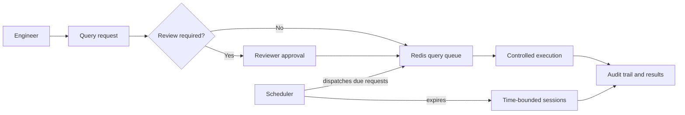

<p align="center">
  
</p>

<h1 align="center">Crucible DB</h1>

<p align="center">
  A governed control plane for reviewed, scheduled, and auditable database access.
</p>

<p align="center">
  <a href="https://github.com/adiwidia-dev/crucible-db/actions/workflows/tests.yml"></a>
  
  
  
</p>

Crucible DB gives engineering teams a safer path to production database work without distributing direct credentials. Every meaningful action moves through a visible control plane: access is scoped by role, sensitive work can be reviewed, execution can be scheduled or time-bounded, and activity is retained in an audit trail.

## Why Crucible DB?

- **Deployment batches** — submit one or more ordered SQL statements, each scoped to its own target connection, for review, scheduling, and asynchronous execution.
- **Time-bounded database access** — request read-only or read + write query sessions across one or more approved connections; sessions automatically expire and enforce their granted access level.
- **Clear accountability** — record requests, reviews, executions, session activity, and administrative actions.
- **Role-scoped access** — grant users the maximum read/write access, reviewer authority, approval requirements, and optional write-session duration through reusable connection groups, with individual connection exceptions where needed.
- **Controlled SQL surface** — administrators can enable each governed statement family or allow all of them. An audited emergency fallback can admit one otherwise unsupported Deployment Batch statement as write access, while administrative, file-access, security-management, procedural, transaction-control, and EXPLAIN ANALYZE SQL remain blocked.
- **Operational guardrails** — show conservative per-statement preflight findings, require fresh preflight immediately before a deployment runs, and block definite safety violations.
- **Follow-up and visibility** — cancel eligible work, create linked retries with fresh policy evaluation, watch important requests or connections, and receive in-app or optional email notifications.
- **Practical authentication** — support password login, invitations, passkeys, two-factor authentication, and Google, GitHub, or Microsoft sign-in.
- **Portable operations** — deploy the complete control plane as one application container plus Redis; application metadata is stored in a persistent SQLite volume.

## How it works



Crucible DB connects to target databases only to test a connection, inspect schema, or execute an authorized request or active session query. It supports PostgreSQL and MySQL target connections. It does not currently expose a general database protocol proxy for desktop database clients.

### Governed SQL behavior

The workspace SQL policy controls the supported read, INSERT, UPDATE, DELETE, CREATE TABLE, ALTER TABLE, DROP TABLE, and TRUNCATE TABLE families. The **Allow all governed statement families** switch overrides the individual family settings without discarding them.

Common-table expressions are classified by their top-level executable statement, so `WITH ... UPDATE`, `WITH ... INSERT`, `WITH ... DELETE`, and `WITH ... SELECT` receive the same policy and preflight treatment as their non-CTE forms.

The optional **Emergency SQL fallback** applies only to Deployment Batches. It treats an otherwise unsupported, single statement as write access, still checks every target role and approval policy, records an explicit preflight warning, and writes audit events. Query Access sessions cannot use this fallback.

Query Access executes exactly one SQL statement at a time. In the SQL editor, **Run** submits the whole editor and requires it to contain one statement. Selecting a statement changes the action to **Run selected**; `Cmd+Enter` on macOS or `Ctrl+Enter` elsewhere executes that selection.

## Quick start for contributors

### Prerequisites

- PHP 8.3 or later
- Composer 2
- Node.js 22
- Docker and Docker Compose (recommended for the full local stack)

### Native setup

```bash
composer setup
composer dev
```

The setup command installs PHP and JavaScript dependencies, creates the local environment file, generates an application key, runs migrations, and builds frontend assets.

### Docker development stack

```bash
docker compose up --build
```

The development Compose stack includes Crucible DB, Redis, Vite, and disposable PostgreSQL/MySQL targets for local testing. The application is available at `http://localhost:8000`.

## Production deployment

Production uses two persistent services:

```text
Crucible DB application
├─ FrankenPHP / Laravel Octane
├─ Laravel Horizon
└─ Laravel scheduler

Redis
├─ queues and Horizon metadata
├─ sessions
└─ cache
```

Production builds must use `Dockerfile.production`, and the published application image is `hephaestus/crucible-db:alpha`. A deployment directory needs `compose.production.yaml`, `.env.production.example`, and a secure `.env.production` file—there is no need to clone the complete source repository or build the image on the server.

```bash
cp .env.production.example .env.production
```

Set a unique application key, public URL, and mail settings in `.env.production`. You can generate an application key with:

```bash
printf 'APP_KEY=base64:%s\n' "$(openssl rand -base64 32)"
```

Then start the stack:

```bash
docker compose -f compose.production.yaml up -d
```

Compose waits for the Redis health check before starting the application. On startup, the application creates the local SQLite file when necessary, runs database migrations, and starts FrankenPHP through Laravel Octane, Horizon, and the scheduler under Supervisor. The `crucible_storage` named volume persists the application SQLite database and storage; `crucible_redis` persists Redis data. Confirm it is healthy with:

```bash
curl --fail http://localhost:8000/health
```

For a production update, back up the persistent storage and Redis volumes first. Then pull the exact production Compose stack and recreate its services:

```bash
docker compose -f compose.production.yaml pull
docker compose -f compose.production.yaml up -d --remove-orphans
docker compose -f compose.production.yaml ps
docker compose -f compose.production.yaml logs --tail=100 app redis
```

The application entrypoint runs forward-only migrations before Supervisor starts Octane/FrankenPHP, Horizon, and the scheduler. Verify the application health after the services are ready:

```bash
curl --fail http://localhost:8000/health
```

## Quality checks

Run the full local verification suite with:

```bash
composer ci:check
```

This runs frontend linting, formatting, TypeScript checks, PHP formatting, PHPStan, and the PHPUnit suite.

## Documentation

- [Product overview](docs/product/overview.md)
- [Design direction](docs/product/design.md)
- [Architecture decisions](docs/architecture/decisions.md)
- [Historical plans](docs/archive/plans/)
- [Historical specifications](docs/archive/specifications/)

## Contributing

Issues and pull requests are welcome. Please keep changes focused, add or update tests for behavior changes, and run `composer ci:check` before opening a pull request.

## License

Crucible DB is licensed under the MIT License.
