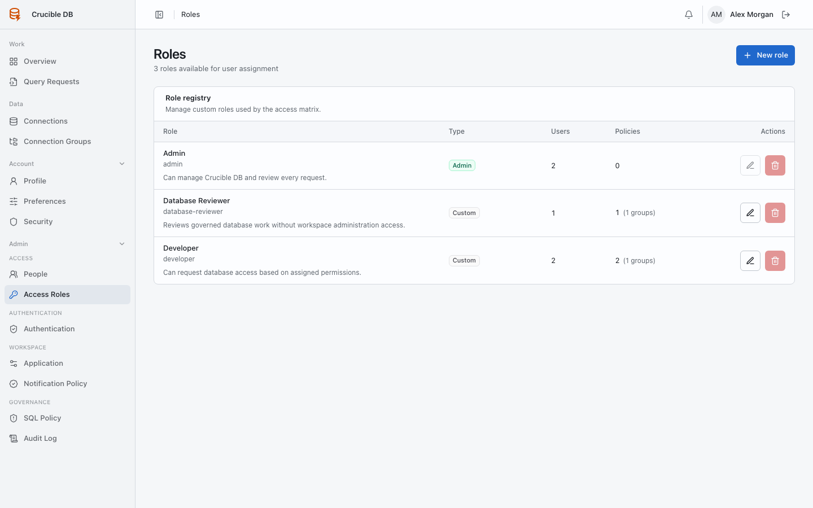
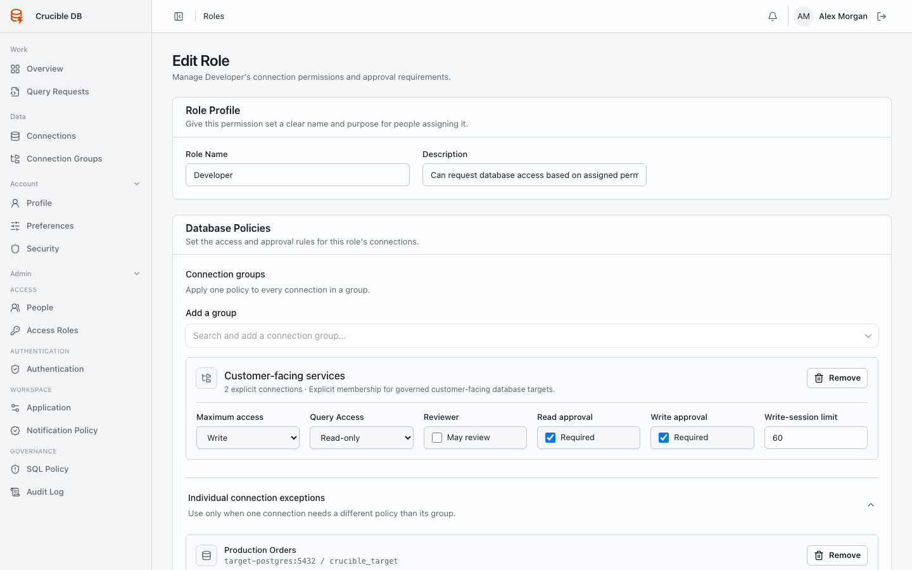

# Access roles

**Who sees it:** workspace administrators under **Admin → Access → Access Roles**.

{ .docs-screenshot }

## Policy controls

For each connection group or individual connection, a role can define:

- maximum deployment access;
- Query Access capability;
- reviewer authority;
- read approval requirement;
- write approval requirement; and
- maximum write-enabled session duration.

{ .docs-screenshot }

Read-only Query Access is the default for write-capable roles. Enable interactive read + write only when the operational need justifies approving access before the exact SQL is known.

An individual connection policy overrides the same role's group policy for that connection. See [Roles, groups, and connections](../concepts/access-policy.md) for evaluation order.

## Lifecycle safeguards

The built-in administrator role cannot be edited or deleted through the role UI. A custom role cannot be deleted while users, individual connection permissions, or connection-group policies still reference it. Remove or migrate those assignments deliberately first.

Administrators cannot change their own role assignment from People. This prevents an accidental self-lockout during routine access administration.
