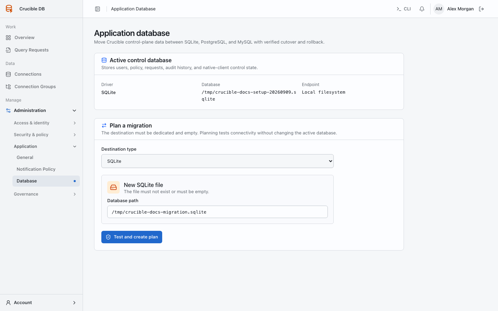

# Application database

**Who sees it:** workspace administrators under **Manage → Administration → Application → Database**.

{ .docs-screenshot }

The application database stores Crucible's users, roles, policies, requests, audit history, notifications, and Native client control state. It is not one of the PostgreSQL or MySQL targets governed through **Data → Connections**.

## Choose a configuration mode

- **Managed mode** lets the first-run setup and this page select SQLite, PostgreSQL, or MySQL. The encrypted selection is stored in the persistent application storage volume.
- **Environment mode** reads the control connection from `DB_*`. The page is informational; change the deployment environment and use the command-line migration workflow for a cutover.

Never change modes casually. Back up the active database, encrypted configuration and migration files, and Redis before changing the deployment topology.

## Plan a migration

The destination must be dedicated and empty. Planning tests connectivity and schema prerequisites without changing the active database. For PostgreSQL or MySQL, the host name must resolve from the application container, not only from the administrator's workstation. The optional Compose test fixtures are available only after starting the `application-database-matrix` profile.

Only one non-terminal plan can exist at a time. Credentials are encrypted in the plan and are never returned to the browser, audit metadata, or command inspection output.

## Copy and verify

Before copying, end active Query Access sessions and Native client leases/connections. Crucible engages a maintenance fence, waits for in-flight scheduled mutations, and drains the queues before copying durable tables in dependency order. Cache, queue, session, and migration bookkeeping tables are rebuilt rather than copied.

The copy verifies row counts and canonical content hashes per table and synchronizes generated identifiers. A failed clean copy leaves the source active and releases the fence. Use **Retry copy** to clean the destination and start again, or **Cancel plan** to return to planning. Error messages expose a correlation reference instead of database SQL or credentials; use that reference in protected application logs.

After the copy completes, select **Verify copy**. Verification fails if the source changed while fenced or if source and destination no longer match.

## Activate safely

Activation writes the verified destination as the managed selection, but the maintenance fence remains active. Restart every Laravel runtime so Octane, Horizon, and the scheduler load the same connection:

```bash
# Production: all Laravel runtimes share the app container.
docker compose --env-file .env.production -f compose.production.yaml restart app

# Development: the runtimes use separate containers.
docker compose restart app worker scheduler
```

The page polls the restarted web runtime and enables **Finalize activation** only when it reports the expected database fingerprint. `/health` remains available while fenced so the application database and Redis can be checked. The Native proxy may temporarily report unhealthy because native control requests intentionally remain blocked until finalization.

Finalization releases the fence and moves the completed plan into collapsed migration history.

## Roll back

The current active migration remains a rollback point in history. **Prepare rollback** fences the application, copies new durable data from the active destination back to the original source, verifies it, and prepares the original source as the active selection. Restart the same Laravel runtimes, wait for the page to confirm the original fingerprint, then finalize.

Rollback is data-preserving, not a restore from an old snapshot. Keep independent backups anyway: a database migration does not replace the installation's backup and disaster-recovery process.
