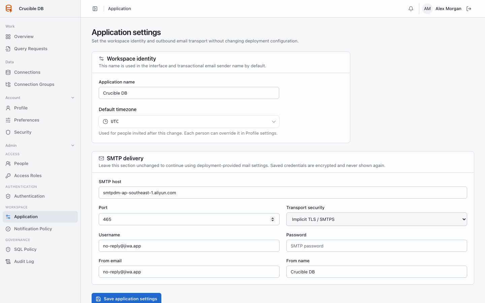
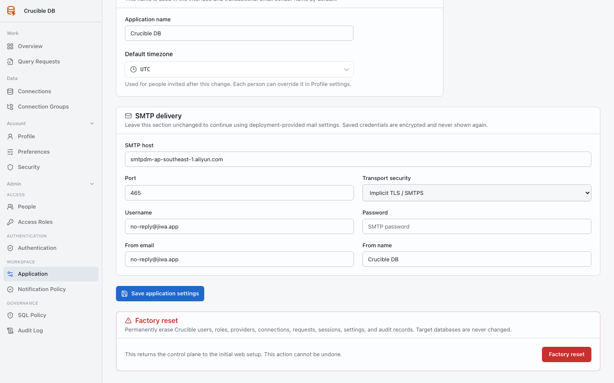

# Application settings

**Who sees it:** workspace administrators under **Admin → Workspace → Application**.

{ .docs-screenshot }

## Workspace identity and time

Set the workspace name and default timezone used when a user has not chosen a personal preference.

## Mail transport

Configure optional SMTP delivery without exposing a stored secret. Test mail settings through an approved non-production recipient before relying on email for operational awareness.

## Factory reset

Factory reset removes control-plane data and returns the application to first-time setup. It is destructive and requires explicit confirmation. Back up persistent application storage first.

{ .docs-screenshot }

The action removes users, roles, providers, connections, requests, sessions, notifications, settings, and audit records from the control plane. Target databases are not changed. The confirmation dialog enables its destructive action only after the exact phrase `RESET CRUCIBLE` is entered.
