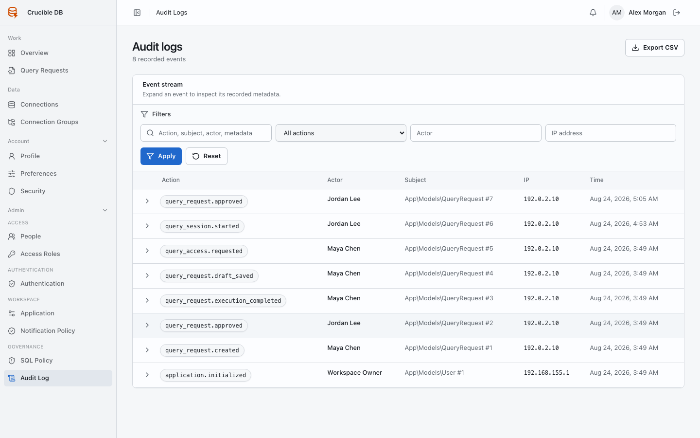

# Audit log

**Who sees it:** workspace administrators under **Admin → Governance → Audit Log**.

{ .docs-screenshot }

Use filters for action, actor, IP address, and free-text context to investigate meaningful user and system activity. Open an event for structured metadata and related-resource context.

## Find an event

- Search across recorded context.
- Filter by an exact action name.
- Filter by the attributed actor.
- Filter by source IP address.
- Combine filters before exporting.

Expanded metadata can include resource identifiers, state transitions, reasons, or safe policy context. Secret values, SQL result rows, and stored credentials must not appear in audit payloads.

Export only when an approved operational or compliance purpose requires it. Treat exports as sensitive operational records and store them according to retention policy.

The CSV export respects the active filters. The audit log is append-oriented application history and complements target database logs; it does not replace database-native monitoring.
