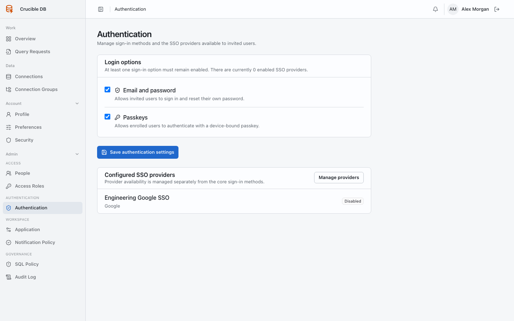
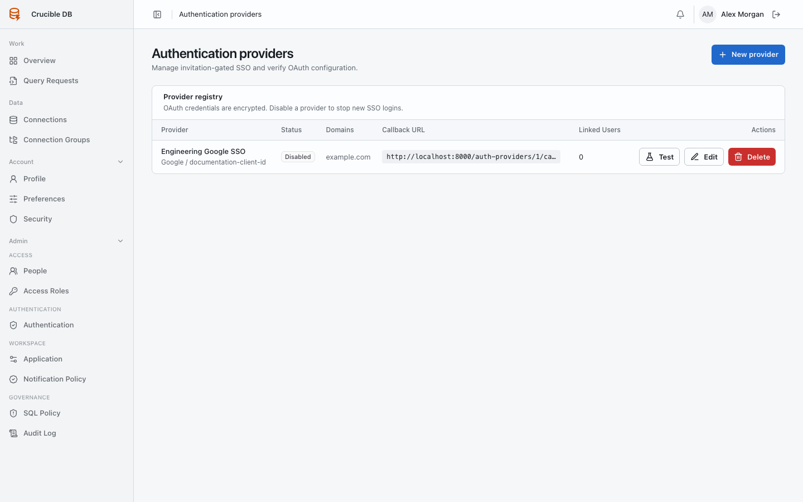

# Authentication

**Who sees it:** workspace administrators under **Admin → Authentication → Authentication**.

{ .docs-screenshot }

## Sign-in methods

Control **Email and password** and **Passkeys** independently alongside configured SSO providers. Do not disable every viable method or create an unrecoverable administrator lockout. The server rejects a configuration that would leave no enabled login path.

## SSO providers

Configure Google, GitHub, or Microsoft provider details, allowed domains, scopes, tenant where applicable, enablement state, and callback URL. Test provider redirect behavior before making SSO the only login path.

{ .docs-screenshot }

Provider configuration is invitation-gated: an SSO identity must match an invited account. Enabling a provider does not create public registration.

Allowed-domain restrictions are enforced after the provider returns a trusted email identity. Google requires a verified email claim, GitHub uses a verified email from the configured scope, and Microsoft uses the trusted directory principal email. Provider errors return to the login page without linking an identity.

Use **Test** on a provider before enabling it as the only login path. Testing validates the redirect and callback configuration without attaching the administrator's identity to a normal login.

Client secrets are encrypted and not returned after storage. Use your identity provider's rotation process when replacing a secret.
