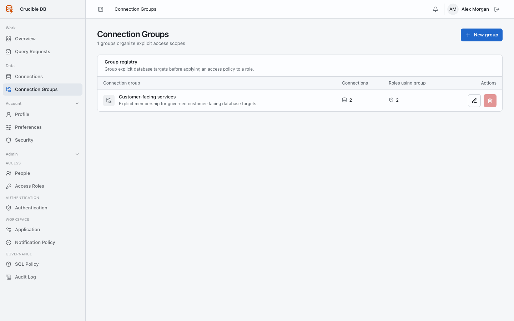
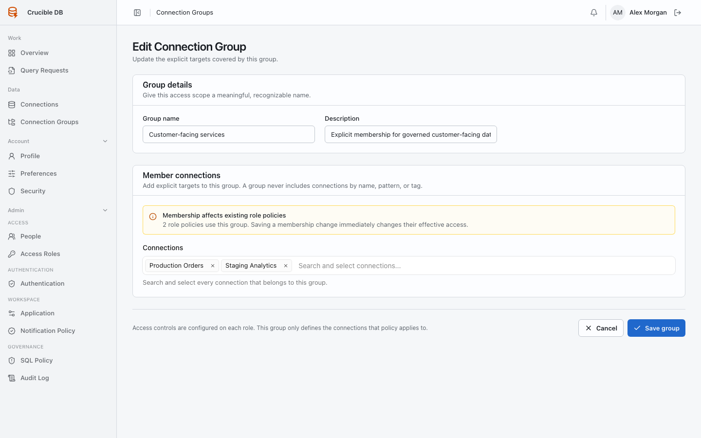

# Connection groups

**Who sees it:** workspace administrators under **Data → Connection Groups**.

{ .docs-screenshot }

Groups are explicit membership lists. They are not dynamic tag queries. A group provides a reusable policy boundary for connections that normally share access requirements.

{ .docs-screenshot }

## Manage a group

1. Use a name that describes the policy boundary.
2. Explain the membership purpose.
3. Select the exact connections.
4. Save, then configure role policies against the group.

Membership changes take effect immediately. Review affected roles and active work before moving a connection between groups.

The editor warns when existing role policies reference the group because membership changes can immediately change effective access for every assigned role.
