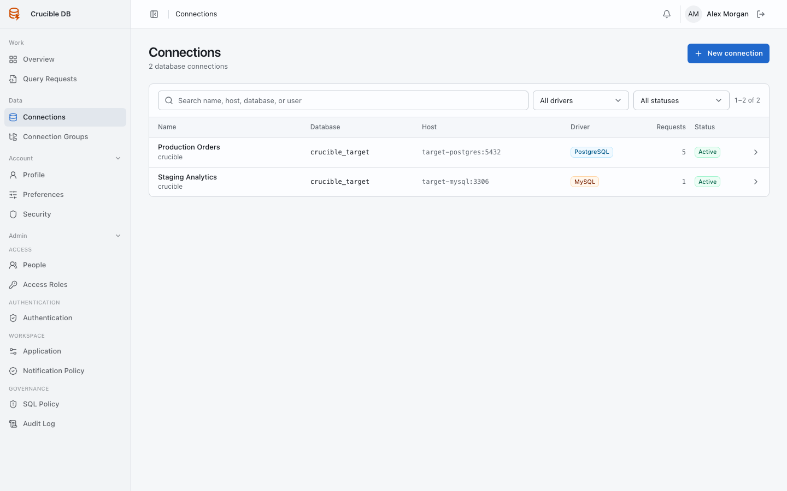
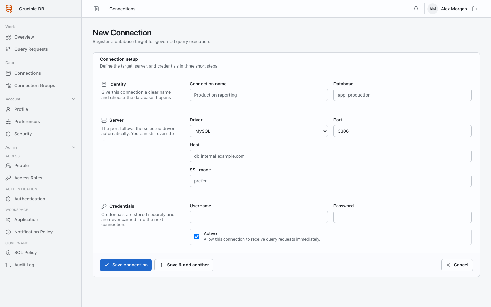

# Manage connections

**Who sees it:** all users see permitted connections; only administrators can create or modify them.

{ .docs-screenshot }

## Create a connection

Provide a clear environment-aware name, driver, host, port, database, username, credential, and transport settings. Test connectivity before assigning role policy.

{ .docs-screenshot }

**Save and add another** supports repeated setup without hiding the just-created target. Stored passwords are encrypted; edit forms do not reveal the existing value.

## Manage lifecycle

Administrators can edit configuration, test health, change active state, and delete an unused connection. Deactivation prevents new governed work from running against the target.

Credentials are encrypted and never returned to ordinary pages, notifications, exports, or audit payloads.

## Apply access

Add the connection to an explicit group, then configure role policy on the group. Use a connection-specific role policy only for a deliberate exception.
