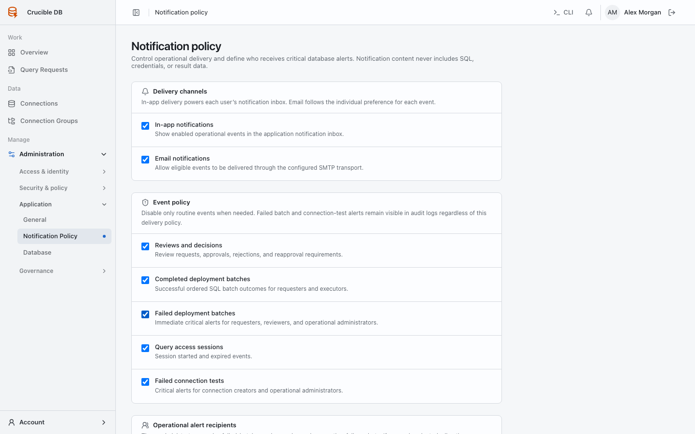

# Notification policy

**Who sees it:** workspace administrators under **Manage → Administration → Application → Notification Policy**.

{ .docs-screenshot }

Control workspace-wide in-app and email delivery plus event defaults for approval requests, SQL policy reviews, successful and failed execution, Query Access lifecycle, and connection failures.

Individual preferences can narrow optional email delivery but cannot create delivery the workspace has disabled. Audit records are independent of notification delivery.

## Delivery channels

- **In-app notifications** power the notification bell and history page.
- **Email notifications** permit eligible events to use the SMTP transport configured under Application.

## Event policy

Approval decisions, SQL policy reviews, completed batches, failed batches, Query Access, and failed connection-test events can be controlled independently. Disabling delivery does not suppress the corresponding audit events. Each user can independently opt into or out of optional SQL policy-review email while in-app delivery follows workspace policy.

## Operational alert recipients

Select administrators who should receive critical failed-batch, session-expiry, and connection-failure alerts. If no administrators are selected, every active administrator becomes an operational recipient. Too many recipients create noise; too few create a single point of failure.

Notification payloads deliberately exclude SQL text, target credentials, and result data. Recipients follow the contextual link and rely on their own authorization to open the resource.
