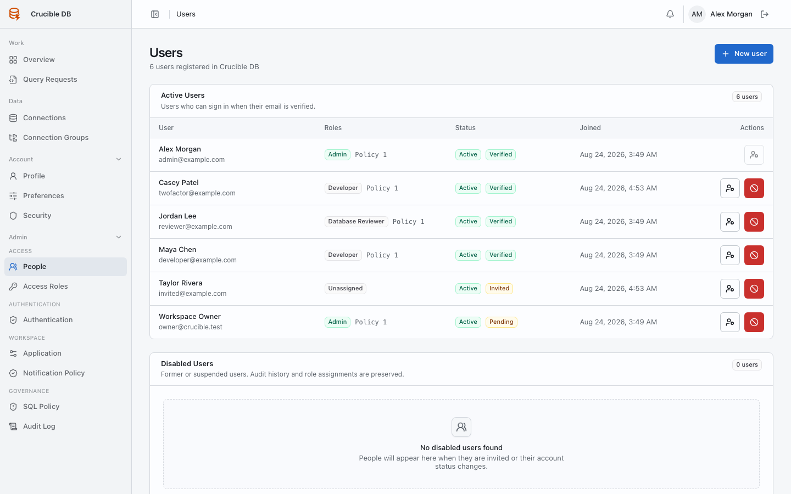
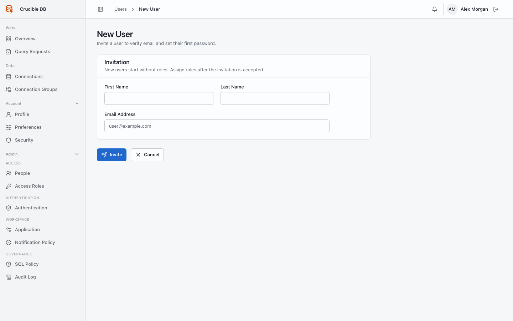

# People

**Who sees it:** workspace administrators under **Admin → Access → People**.

{ .docs-screenshot }

## Invite a user

Create an invitation using the person's name and organizational email.

{ .docs-screenshot }

An invitation does not assign database access. The recipient sets a password or uses an enabled invited SSO identity, while administrators assign role precedence separately. Invitation links expire after seven days.

## Assign roles

Users can hold multiple roles. Order matters: the first applicable role supplies an overlapping policy. Avoid duplicate priorities and make precedence understandable to reviewers.

The People list distinguishes active, pending invitation, and disabled accounts. Role changes and enable/disable actions are audited.

## Enable or disable access

Disable a user when access must stop without deleting historical ownership. Disabled users cannot sign in, while their past requests, reviews, executions, and audit attribution remain intact.

An administrator cannot change their own role assignment on this page. Use another authorized administrator for changes to administrator access.
