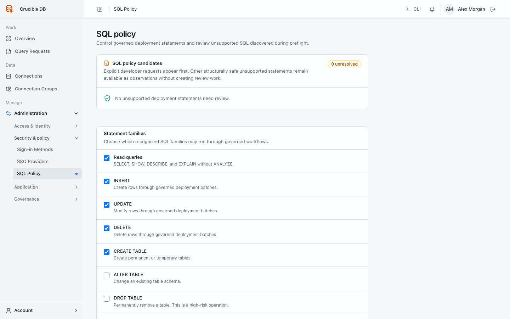
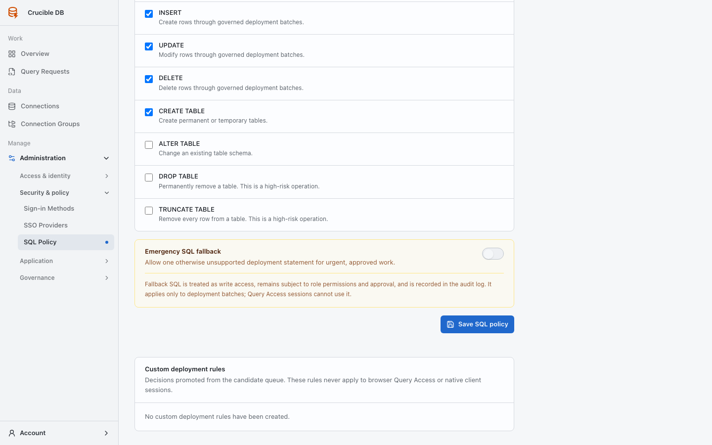

# SQL policy

**Who sees it:** workspace administrators under **Manage → Administration → Security & policy → SQL Policy**.

{ .docs-screenshot }

## Statement families

Enable read, `INSERT`, `UPDATE`, `DELETE`, `CREATE TABLE`, `ALTER TABLE`, `DROP TABLE`, and `TRUNCATE TABLE` individually according to workspace policy.

There is no separate all-families override. Every enabled family shown on this page is part of the effective policy.

## Emergency SQL fallback

Emergency fallback is a separately enabled Deployment Batch exception for one otherwise unsupported statement. It is classified as write, warned in preflight, approval-controlled, and audited. It never applies to Query Access and never permits permanently prohibited SQL categories.

{ .docs-screenshot }

Changing statement policy can affect drafts, approved work, and active sessions at the next server-side check. Review currently prepared work before tightening or expanding policy.

## Policy-review queue

Developers can explicitly request review when a Deployment Batch is blocked only by structurally reviewable unsupported SQL. These requests appear in three places:

- the administrator Overview operational queue and **Attention** summary count;
- the badge beside **SQL Policy** in administration navigation; and
- the notification inbox, with optional email delivery controlled by workspace notification policy and each administrator's preferences.

Requested candidates appear before passive observations on this page and carry a **Review requested** badge. Review the originating draft and choose the narrowest appropriate decision:

- allow the exact statement;
- allow a parser-proven reusable shape where offered;
- deny the exact statement; or
- dismiss the observation without creating a rule.

A decision note is required for denial and dismissal and is sent to the requester. Allowing a candidate refreshes affected preflight reports, but the Deployment Batch remains a draft until its requester submits it through the normal approval flow.

See [SQL statement policy](../concepts/sql-policy.md) and [Supported SQL](../reference/supported-sql.md).
