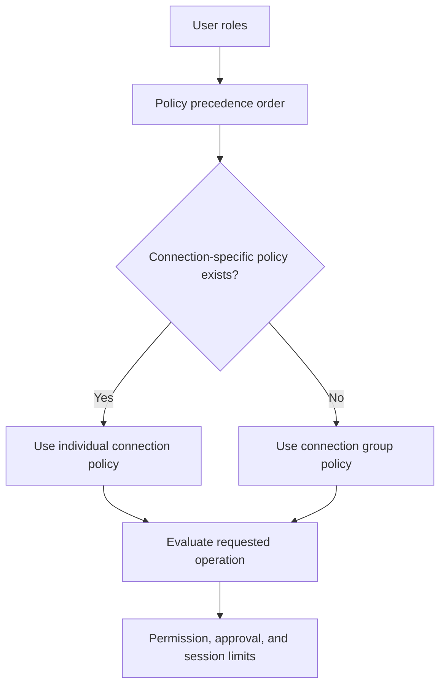

# Roles, groups, and connections

Crucible DB evaluates access at the selected connection. Roles make that evaluation reusable, connection groups provide the usual scope, and a connection-specific rule can make a deliberate exception.

## The policy model

### Connection groups

A connection group is an explicit list of connections. It is not a dynamic tag query. Add a connection to a group only when its members should normally share a policy boundary.

Examples:

- `Production customer data`
- `Staging services`
- `Analytics replicas`

Changing group membership changes effective policy immediately.

### Role policies

A role policy can define the following for a group or individual connection:

- **Maximum deployment access**: none, read, or write.
- **Query Access capability**: read-only, or read + write when the maximum deployment access is write.
- **Reviewer authority**.
- **Read approval requirement**.
- **Write approval requirement**.
- **Maximum write-session duration**, when applicable.

Read-only is the default Query Access capability for a write-capable role. This separates the ability to submit a reviewed deployment from the ability to perform unknown interactive writes after a session is approved.

### Precedence and exceptions

Users can hold more than one role. The workspace’s ordered **Policy precedence** list decides which applicable role governs an overlapping scope, with the first applicable role winning.

Within the same role, an individual connection policy overrides that role’s group policy for the same connection. Use individual rules sparingly, and record why the exception exists.

## How approval is decided

For a Deployment Batch, Crucible DB evaluates all statement targets and types. If any applicable selected policy requires approval, approval is required for the whole request.

For Query Access, the requested session level must be permitted for every selected connection. The selected level and current policy are both enforced on each query.

!!! example "Example"
    A user has deployment write access for two production connections. One connection allows read-only Query Access, while the other allows read + write. A multi-connection Query Access request can only be read-only because every selected target must allow the requested level.

## Administrator checklist

1. Create a group for stable shared scope.
2. Give each role the least access it needs.
3. Keep interactive Query Access read-only unless a real operational need requires write.
4. Require approval for high-impact reads and writes as appropriate.
5. Put reviewer authority in a role held by independent reviewers.
6. Revisit individual overrides and precedence after organizational changes.
