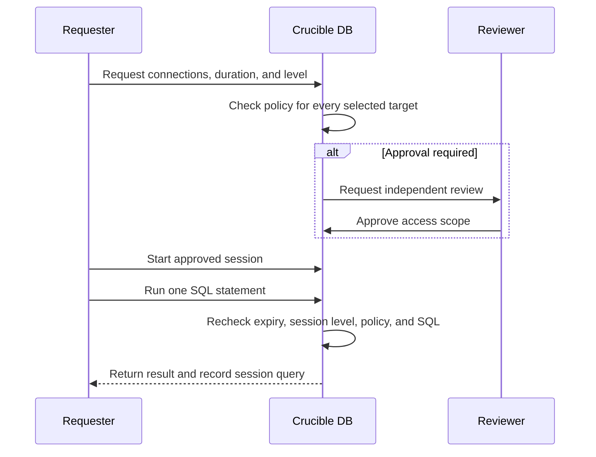

# Preflight, approvals, and audit

Crucible DB uses multiple controls in sequence. No single approval or setting bypasses the others.

## Deployment Batch flow

```mermaid
sequenceDiagram
    participant R as Requester
    participant C as Crucible DB
    participant V as Reviewer
    participant Q as Queue worker

    R->>C: Create or edit batch
    C->>C: Validate targets, policy, SQL, and schedule
    alt Preflight blocked
        C-->>R: Show block; draft may still be saved
    else Ready or warning
        C-->>R: Submit request
        alt Approval required
            C->>V: Notify eligible reviewers
            V->>C: Approve or reject
        end
        C->>C: Fresh preflight before dispatch
        C->>Q: Execute ordered statements
        Q-->>C: Record per-statement result
        C-->>R: Notify and retain audit events
    end
```

## Query Access flow



## What preflight checks

Preflight evaluates each Deployment Batch statement for SQL classification, target validity, effective access policy, approval requirements, schedule conditions, and known risk patterns. It produces a per-statement report.

- **Warnings** guide the requester and reviewer.
- **Blocks** prevent the work from moving forward.
- A fresh strict check immediately before execution protects against stale target or policy assumptions.

## Auditability

Crucible DB records meaningful lifecycle and administrative events. The audit record is designed to answer: who made a decision, what scope they acted on, when it happened, and what the system did as a result.

Auditability complements, but does not replace, the target database’s own logging and change controls.
