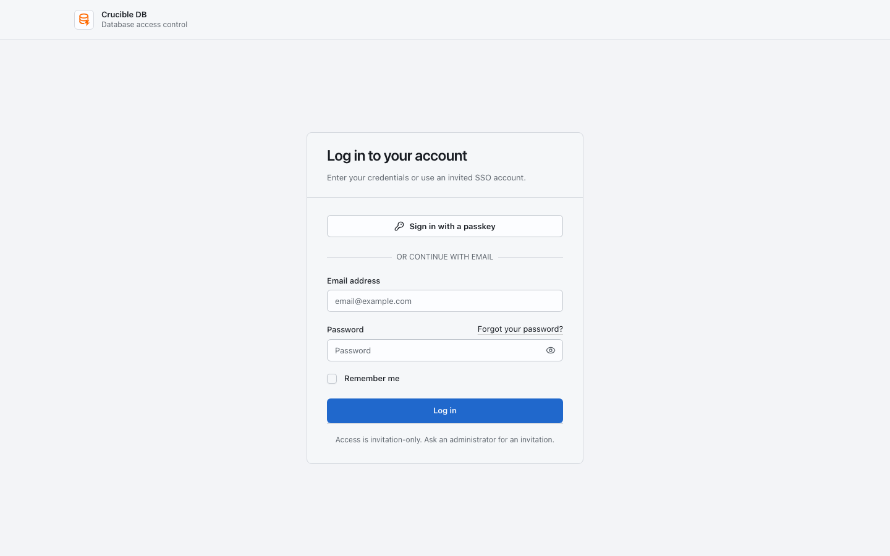
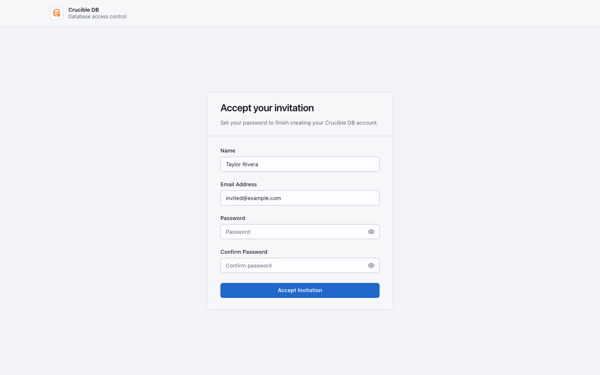
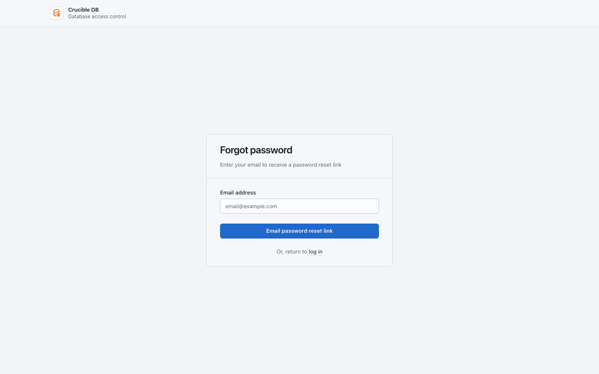
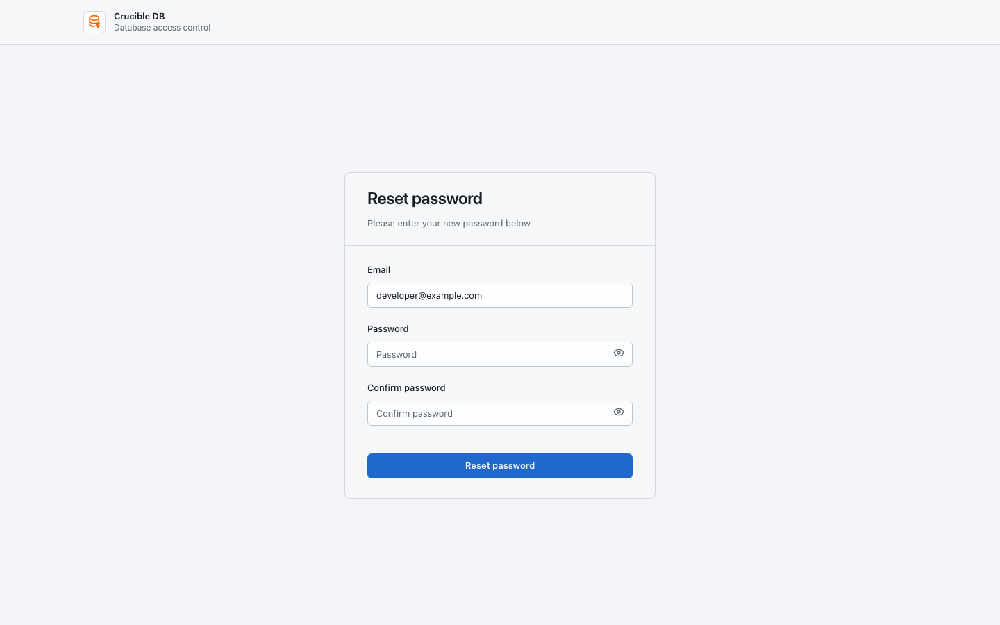
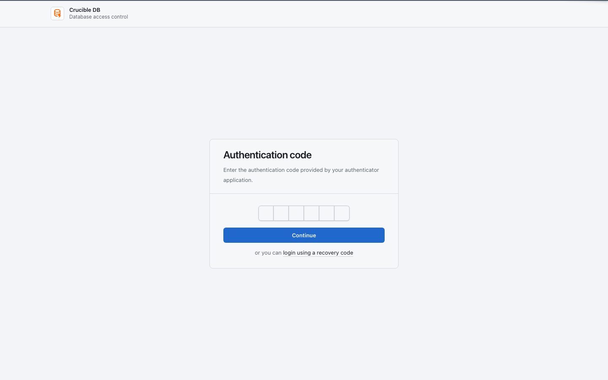

# Sign in and secure your account

Crucible DB is invitation-only. An administrator invites you, assigns your roles, and may configure additional sign-in providers for the workspace.

{ .docs-screenshot }

## Sign in

1. Open the workspace URL supplied by your administrator.
2. Sign in with a passkey when available, enter your email and password, or choose an enabled invited SSO provider.
3. Complete two-factor authentication when prompted.

The login page does not reveal whether an uninvited email address belongs to a workspace account.

## Accept an invitation

1. Open the invitation link sent to your email.
2. Verify the displayed workspace and email address.
3. Create your password, or continue through the invited SSO provider if offered.
4. Sign in and review your account settings.

{ .docs-screenshot }

Invitation links expire after seven days. If a link expires, ask an administrator for a new invitation. Do not forward an invitation link. Accepting an invitation verifies the invited email, but does not grant database access by itself; an administrator must assign an effective role.

## Recover a password

Select **Forgot your password?** on the login page, enter the invited account email, and request a reset link. Email delivery must be configured by the workspace administrator.

{ .docs-screenshot }

Open the signed reset link from the email and choose a new password that satisfies the displayed workspace rules.

{ .docs-screenshot }

## Complete a two-factor challenge

Enter the six-digit code from the configured authenticator. If the authenticator is unavailable, switch to one unused recovery code. A consumed recovery code cannot be reused.

{ .docs-screenshot }

Protected account actions may ask for recent confirmation. Use a registered passkey or the current password when the confirmation page appears.

## Protect your account

Open **Account → Security** after sign-in to manage password, passkeys, and two-factor authentication.

- Prefer a passkey on a device you control when your organization permits it.
- Store two-factor recovery codes in an approved password manager, not in a shared chat or ticket.
- Use a unique password if you use password sign-in.
- Sign out from shared workstations.

!!! danger "Never share access"
    Crucible DB records actions under the signed-in user. Shared accounts and shared recovery codes remove the accountability the control plane is designed to provide.
