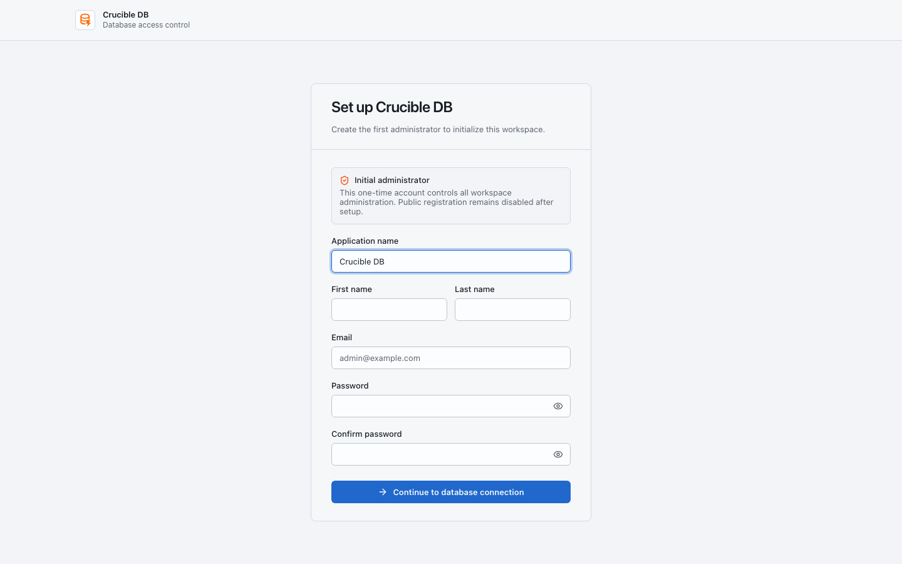
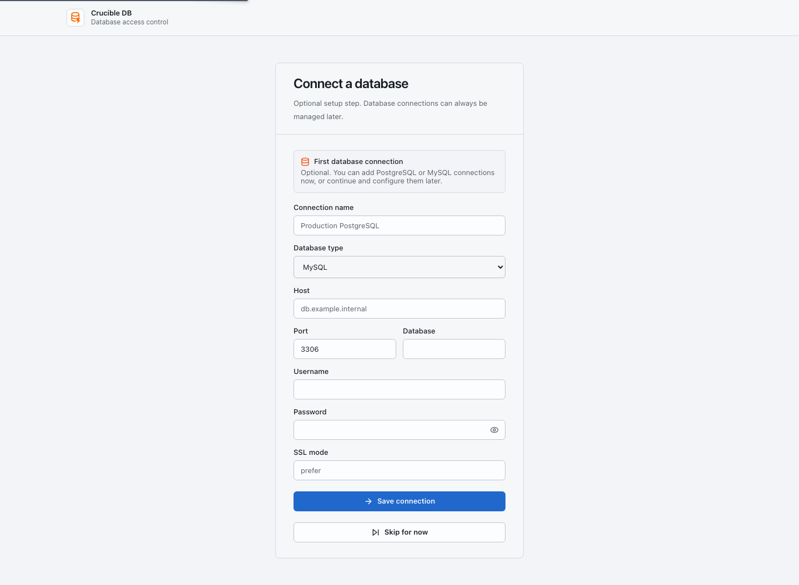

# First-time workspace setup

This guide is for the first workspace owner. Complete setup before inviting ordinary users.

{ .docs-screenshot }

## 1. Create the workspace owner

Use the initial setup page to create the first owner account. The owner can configure workspace settings, connections, connection groups, role policies, authentication, SQL policy, and invitations.

## 2. Add and test a connection

Open **Data → Connections → New connection**. Enter a clear name, driver, host, port, database, and credential. Use a name that tells operators where it points, such as `production-orders` or `staging-analytics`.

{ .docs-screenshot }

Test the connection before relying on it. A successful test proves that Crucible DB can reach the target with the supplied credential; it does not grant a user permission to perform database work there.

## 3. Create an explicit connection group

Open **Admin → Access → Connection groups** and add selected connections to a group. Groups are explicit membership lists, not tag or search-based rules.

Use groups for a stable policy boundary, for example `Production customer data` or `Staging services`. Membership changes take effect immediately for role policy evaluation.

## 4. Define roles and policy

Open **Admin → Access → Roles**. For every relevant group or individual connection, configure the maximum deployment access, reviewer authority, approval requirements, and Query Access capability.

Read [Roles, groups, and connections](../concepts/access-policy.md) before granting write access. Connection-specific policy overrides the same role's group policy for that connection.

## 5. Set SQL policy

Open **Admin → Governance → SQL policy**. Enable only the SQL statement families your workspace intends to govern. Leave Emergency SQL fallback disabled unless you have an operationally approved reason for its narrow, audited use.

## 6. Invite users and verify a workflow

Invite a requester and an independent reviewer. Then test a harmless read-only Query Access request and a harmless Deployment Batch. Confirm that notifications, review, result, and audit records are visible.
