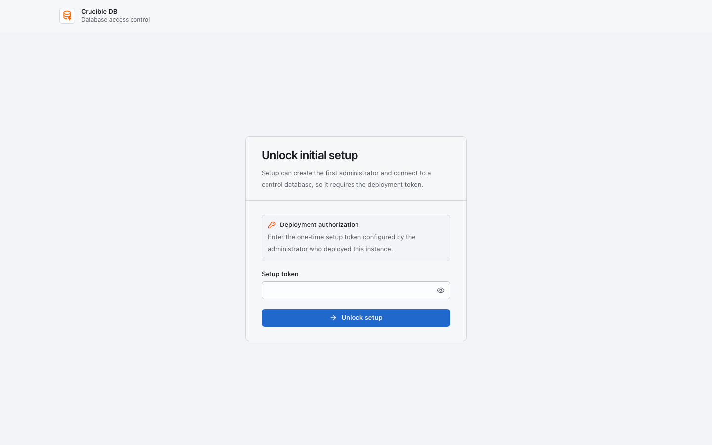
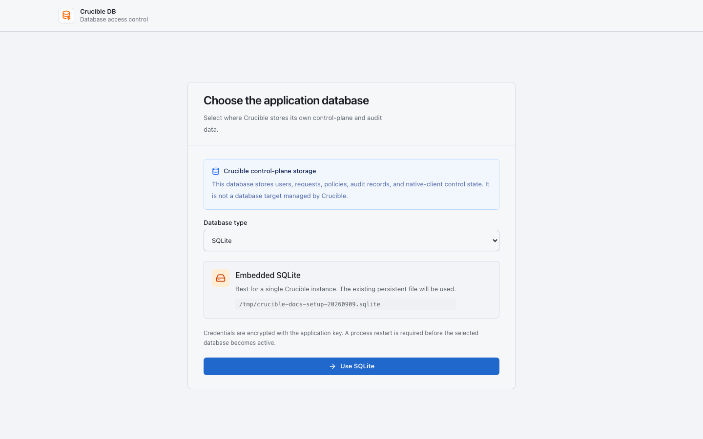

# First-time workspace setup

This guide is for the deployment administrator and first workspace owner. Complete setup before inviting ordinary users.

{ .docs-screenshot }

## 1. Unlock initial setup

Enter the `CRUCIBLE_INITIAL_SETUP_TOKEN` supplied by the person who deployed the instance. The token must contain at least 32 characters. It authorizes the sensitive first-run workflow; it is not an application account or a reusable login credential.

The development Compose default is `crucible-local-initial-setup-token`. Never use that default on a remotely reachable installation.

## 2. Choose the application database

Choose where Crucible stores its own users, policy, requests, audit history, and native-client control state. This is separate from the target databases governed by Crucible.

{ .docs-screenshot }

- **SQLite** uses the persistent local file and is appropriate for one Crucible instance.
- **PostgreSQL** or **MySQL** requires a dedicated empty database. Crucible tests the connection, refuses to overwrite existing tables, and prepares the schema.

Credentials are encrypted with `APP_KEY`. After saving the selection, restart every Laravel runtime shown on the page. In development, run `docker compose restart app worker scheduler`. Continue only after **Check activation** confirms that the web runtime loaded the selected database.

{ .docs-screenshot }

## 3. Create the workspace owner

Use the initial setup page to create the first owner account. The owner can configure workspace settings, connections, connection groups, role policies, authentication, SQL policy, and invitations.

## 4. Add and test a target connection

Open **Data → Connections → New connection**. Enter a clear name, driver, host, port, database, and credential. Use a name that tells operators where it points, such as `production-orders` or `staging-analytics`.

{ .docs-screenshot }

Test the connection before relying on it. A successful test proves that Crucible DB can reach the target with the supplied credential; it does not grant a user permission to perform database work there.

## 5. Create an explicit connection group

Open **Data → Connection Groups** and add selected connections to a group. Groups are explicit membership lists, not tag or search-based rules.

Use groups for a stable policy boundary, for example `Production customer data` or `Staging services`. Membership changes take effect immediately for role policy evaluation.

## 6. Define roles and policy

Open **Manage → Administration → Access & identity → Access Roles**. For every relevant group or individual connection, configure the maximum deployment access, reviewer authority, approval requirements, and Query Access capability.

Read [Roles, groups, and connections](../concepts/access-policy.md) before granting write access. Connection-specific policy overrides the same role's group policy for that connection.

## 7. Set SQL policy

Open **Manage → Administration → Security & policy → SQL Policy**. Enable only the SQL statement families your workspace intends to govern. Leave Emergency SQL fallback disabled unless you have an operationally approved reason for its narrow, audited use.

## 8. Invite users and verify a workflow

Invite a requester and an independent reviewer. Then test a harmless read-only Query Access request and a harmless Deployment Batch. Confirm that notifications, review, result, and audit records are visible.

After setup completes, the persistent setup sentinel prevents the first-run routes from reopening, even if all users are later removed. Rotate or remove the deployment setup token from the runtime environment.
