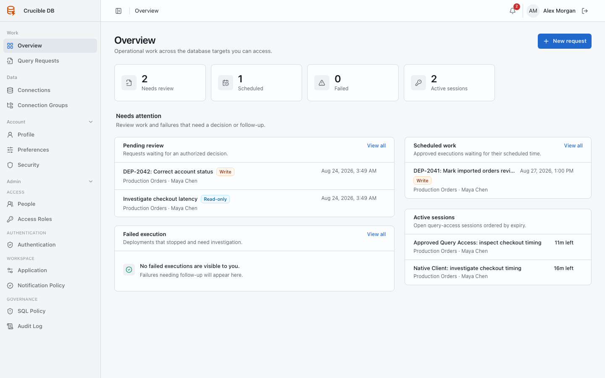

# Roles and navigation

Crucible DB changes the available data and administration controls according to your effective roles. Requesters and reviewers use the same operational workspace. Administrators receive an additional administration area.

## Ordinary user

An ordinary user sees the menus required to request and track database work:

- **Work → Overview**: personal work and operational items that need attention.
- **Work → Query Requests**: Deployment Batches and Query Access requests.
- **Data → Connections**: only connections allowed by effective role policy.
- **Account → Profile**: name, email, and account deletion.
- **Account → Preferences**: appearance, timezone, email preferences, and watched resources.
- **Account → Security**: password, two-factor authentication, and passkeys.
- **Notifications** in the top bar: recent operational events and notification history.

{ .docs-screenshot }

## Reviewer-capable user

A reviewer sees the same menus as an ordinary user. Reviewer authority does not expose the administrator menus. Reviewable requests appear in **Overview**, **Query Requests**, and the request detail page.

{ .docs-screenshot }

## Workspace administrator

An administrator sees every ordinary menu plus:

- **Data → Connection Groups**.
- **Admin → Access → People**.
- **Admin → Access → Access Roles**.
- **Admin → Authentication → Authentication**.
- **Admin → Workspace → Application**.
- **Admin → Workspace → Notification Policy**.
- **Admin → Governance → SQL Policy**.
- **Admin → Governance → Audit Log**.

{ .docs-screenshot }

!!! note "Permission is evaluated at the target"
    Seeing a menu does not grant unrestricted database access. Every request and query is evaluated against the user's effective policy for the selected connection.
