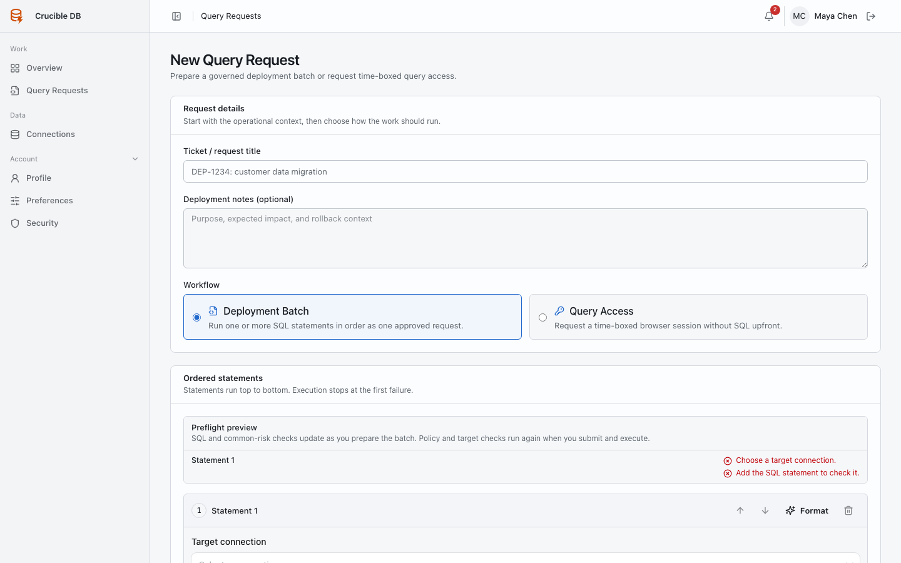
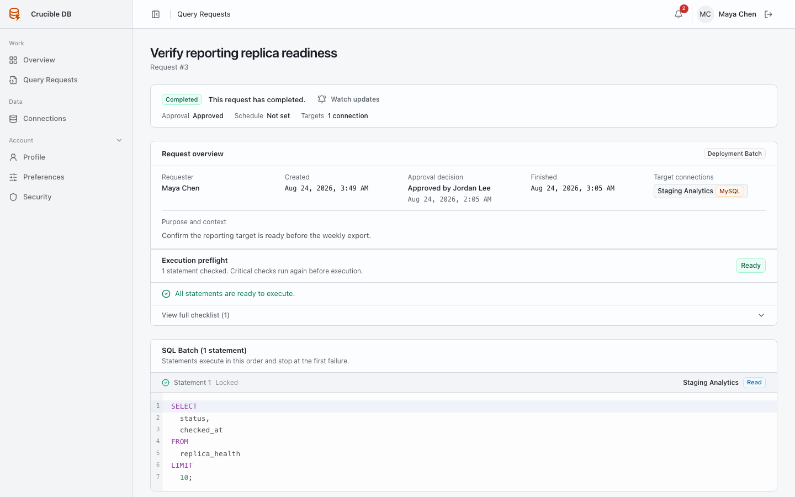

# Create and run a Deployment Batch

Use a Deployment Batch when you know the SQL statements that must run, their order, and their target connections.

{ .docs-screenshot }

## Before you start

You need effective deployment access to every selected connection. A batch can contain one or more statements, but each row must contain exactly one SQL statement and one target connection.

Prepare:

- The intended SQL, split into execution order.
- The target connection for each statement.
- A clear request title and operational context for a reviewer.
- A safe execution time, if the batch should not start immediately.

## Create the batch

1. Open **Work → Query requests → New request**.
2. Select **Deployment Batch**.
3. Add a title that states the intended outcome.
4. Add one statement row at a time. Choose its connection, then enter exactly one SQL statement.
5. Review the preflight report for each statement.
6. Choose **Submit for review** when the batch is ready, or [save it as a draft](deployment-drafts.md) when it is not.

## Read the preflight report

| Result | Meaning | What to do |
| --- | --- | --- |
| **Ready** | No findings block the request. | Submit when the scope is correct. |
| **Ready with warnings** | The request can proceed, but a risk needs reviewer attention. | Explain the reason in the request context. |
| **Blocked** | Definite SQL, target, policy, or schedule failure. | Correct the work or save a draft. |

Common warnings include an unbounded `SELECT` and an `UPDATE` or `DELETE` without a `WHERE` clause. Warnings do not silently disappear at execution time: fresh preflight runs again immediately before dispatch.

## Approval and scheduling

If any selected connection and statement type requires approval, the whole batch requires an independent reviewer. You cannot approve your own request.

After approval, the batch can be dispatched immediately or wait for its requested schedule. If its requested time passes while it is awaiting review, approval does not run it late. An authorized person must dispatch it explicitly.

## Execution results

Statements run in their listed order. Execution stops at the first failure. The request keeps its completed and failed statement records, result details, notifications, and audit events.

{ .docs-screenshot }

Where recorded rows exist, use **Export CSV** from the execution result. The export never contains target credentials. Treat exported database content according to your organization's data handling policy.

!!! note "A batch is sequential, not atomic"
    Crucible DB intentionally blocks `BEGIN`, `COMMIT`, `ROLLBACK`, savepoints, and related transaction-control SQL. Do not treat a batch as a user-controlled transaction wrapper.

## Cancel or retry

Eligible work can be cancelled with a reason. A failed request may offer a linked retry. Write-impacting retry work receives fresh policy and approval evaluation.
