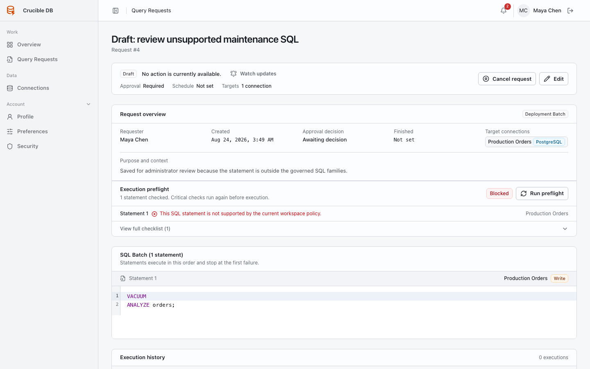

# Save and work with Deployment Batch drafts

A draft preserves a Deployment Batch without making it executable. Use it for incomplete work, blocked preflight findings, or a batch that needs more review before it is submitted.

{ .docs-screenshot }

## What a draft does

- Stores the title, statement order, target connections, SQL, and latest preflight report.
- Can retain a report that is currently blocked.
- Cannot create review work, notifications, schedules, or execution jobs.
- Remains editable until you submit it.

## Save a draft

On the Deployment Batch form, choose **Save draft**. You can do this even when preflight blocks submission.

Use a title that lets another engineer understand the intended change. Record assumptions or open questions in the request context before handing it over.

## Run preflight again

Open the saved draft and select **Run preflight** after changing SQL, targets, or relevant context. This records a fresh report and an audit event without submitting the work.

The request detail shows the blocker beside the affected statement. Editing the SQL or target marks older preflight context stale until the next check.

!!! warning "Preflight is informative until submit"
    A draft's last report helps you work, but submission always repeats strict server-side validation and a fresh preflight. A draft that looked ready earlier can be blocked if policy or targets changed.

## Submit a draft

When the batch is ready:

1. Open the draft.
2. Verify every statement, target, schedule, and preflight finding.
3. Choose **Submit for review**.
4. Resolve any fresh blocking message instead of assuming the saved report is still valid.

## Cancel a draft

Use **Cancel request** only when the work should not continue. Cancellation records a reason and leaves an audit trail. It does not delete the historical request record.
