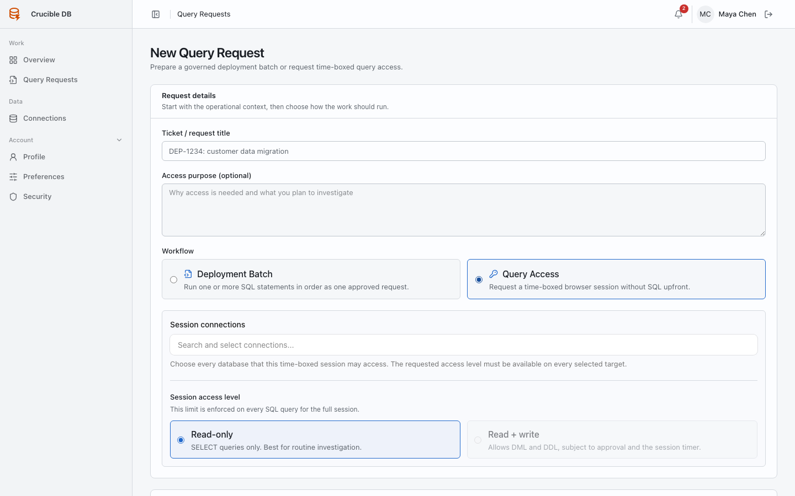

# Request Query Access

Use Query Access for a time-bounded browser session on one or more connections. It is intended for investigation, controlled repair, or exploratory work that does not fit a fixed Deployment Batch.

The request form presents Deployment Batch and Query Access side by side. Select Query Access before choosing connections and a session level.

{ .docs-screenshot }

## Choose the right session level

| Level | You can do | You cannot do |
| --- | --- | --- |
| **Read-only** | Inspect schema and run permitted read queries. | Run data-changing SQL. |
| **Read + write** | Run permitted read and data-changing SQL during the approved window. | Bypass SQL policy, use emergency fallback, or exceed current role policy. |

The **Read + write** option is visible only when the effective Query Access policy for every selected connection permits it. A role's deployment write access does not automatically grant Query Access write capability.

## Create a request

1. Open **Work → Query requests → New request**.
2. Select **Query Access**.
3. Select the connection or connections you need.
4. Choose a duration that fits the work.
5. Select read-only or read + write when offered.
6. Describe why you need access and the expected work.
7. Submit the request.

Query Access scope cannot be edited after creation. Cancel an incorrect request and create a new one so its targets, duration, level, policy, and approval history remain unambiguous.

If any selected target requires approval for the requested level, the request waits for an independent reviewer. The reviewer approves the bounded access scope, not an unknown future SQL statement.

## After approval

Open the approved request and choose **Start session**. Select the active connection when multiple connections were approved. The session shows its declared access level and expiry.

When an active session already exists, the request action changes to **Resume Session**. Starting or resuming never expands the approved connection set, access level, or duration.

You can end a session early. Once it ends or expires, it cannot execute more SQL. A follow-up request must be evaluated against current policy again.

## Why a query can still be blocked

Every query is checked at execution time. It may be blocked because:

- the session is read-only;
- the session expired or ended;
- the effective role policy changed;
- the SQL family is disabled by workspace policy; or
- the statement belongs to a permanently prohibited category.

See [Supported SQL](../reference/supported-sql.md) for the boundaries.

Continue with [Run SQL in a Query Access session](query-session-editor.md).
