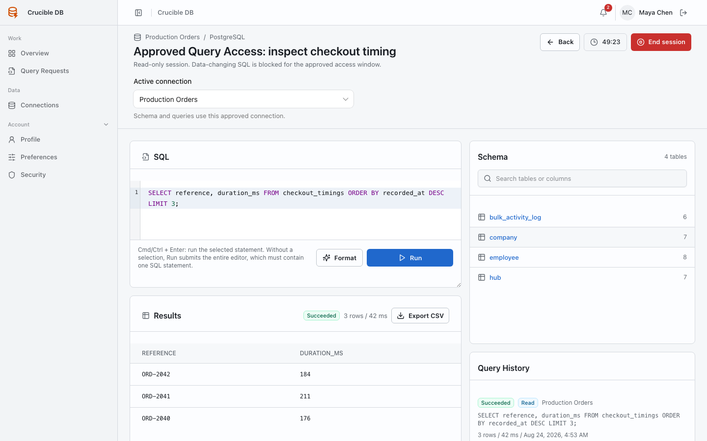

# Run SQL in a Query Access session

The Query Access SQL editor executes exactly one statement per request. This keeps access enforcement, audit history, and result ownership unambiguous.

{ .docs-screenshot }

## Session header and connection scope

The header displays the request title, requester, read-only or read + write level, remaining time, and active connection. For multi-connection access, switch the active connection before inspecting schema or running SQL. The selected connection must belong to the approved session.

## Run the editor content

Enter one SQL statement in the editor and select **Run**. The application submits the whole editor content.

If the editor contains multiple statements, Crucible DB returns: **Only one SQL statement may be submitted per request.** Select the statement you intend to run instead of deleting the rest of your working notes.

## Run a selected statement

Select the exact SQL statement in the editor. The primary action changes from **Run** to **Run selected**. The selected text is highlighted and only that text is submitted.

You can use the keyboard shortcut while the editor has focus:

| Platform | Shortcut |
| --- | --- |
| macOS | ++cmd+enter++ |
| Windows and Linux | ++ctrl+enter++ |

Without a selection, the shortcut runs the whole editor and therefore requires exactly one statement.

## Work safely

- Confirm the active connection before every run.
- Use a narrow `LIMIT` for exploratory reads.
- Read the session level shown beside the editor before attempting a write.
- Keep work that must be repeatable or reviewed as a Deployment Batch instead.
- Do not rely on the editor as a transaction console. Transaction-control SQL is blocked.

## Results and history

Each execution is retained in the session query history. The result panel shows status, connection, row count, truncation marker, duration, rows, or a database error. **Export CSV** is available only for a successful recorded result with rows; it does not expose connection credentials.

The Schema panel searches discovered tables and columns for the active connection. Selecting a table or column inserts a safe identifier snippet into the editor; it does not execute SQL.

## End or expire a session

Use **End session** with a reason when work finishes early. Expiry closes the approved window automatically. Ended, cancelled, or expired access cannot run more SQL. A linked follow-up request receives fresh current-policy and approval evaluation.
