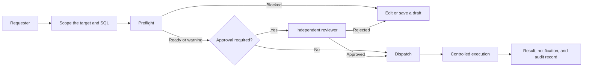

# Crucible DB documentation

Crucible DB is a governed control plane for database operations. It gives engineering teams a clear, auditable route to database work without distributing direct production credentials.

Use this documentation to request and review SQL work, grant time-bounded browser or native-client access, configure workspace policy, and operate the application safely.

## Choose your task

| If you need to… | Start here |
| --- | --- |
| Submit ordered SQL for deployment | [Deployment batches](guides/deployment-batches.md) |
| Keep a blocked or unfinished batch without sending it for review | [Deployment drafts](guides/deployment-drafts.md) |
| Obtain temporary access to inspect or change data | [Request Query Access](guides/query-access.md) |
| Use DBeaver, DataGrip, `psql`, or another desktop client | [Native Client access](guides/native-client-access.md) |
| Approve or reject someone else's work | [Review requests](guides/review-requests.md) |
| Configure roles, connections, and SQL guardrails | [Roles, groups, and connections](concepts/access-policy.md) |
| Upgrade the production installation | [Production deployment and upgrades](operations/production.md) |
| Recover or secure your account | [Sign in and secure your account](getting-started/account-security.md) |
| Monitor queues and scheduled work | [Queues, workers, and schedules](operations/queues-and-workers.md) |

## The operating model

Crucible DB keeps the current state and next safe action close together. A preflight warning informs you; a definite policy, target, or SQL safety failure blocks execution.

!!! tip "New to the workspace?"
    Start with [Learn Crucible DB](getting-started/overview.md). It explains the difference between a Deployment Batch and Query Access before you create a request.

## What Crucible DB does not do

Crucible DB supports PostgreSQL and MySQL targets through browser workflows and approved Native client sessions. Native access is a private, loopback-only CLI tunnel; it is not a public direct database endpoint. Crucible does not turn a deployment batch into a user-controlled transaction: transaction-control SQL remains blocked.
