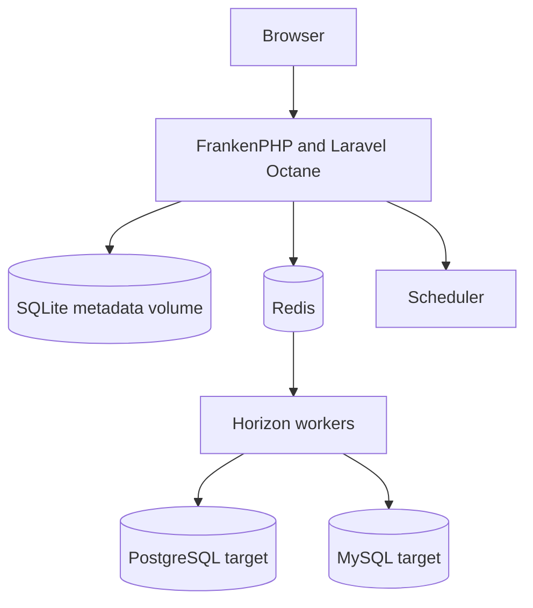

# Architecture

Crucible DB is a Laravel control plane with a React/Inertia application interface. It connects to target PostgreSQL and MySQL databases only to test a connection, inspect schema, or execute an authorized Deployment Batch or active Query Access statement.

## Components

| Component | Responsibility |
| --- | --- |
| Laravel + Inertia React | Application workflows, authorization, validation, and browser UI. |
| FrankenPHP + Octane | Long-running HTTP runtime. |
| Redis | Queues, Horizon metadata, sessions, and cache. |
| Horizon | Runs queued database operation jobs. |
| Scheduler | Dispatches due work and session-expiry tasks. |
| SQLite volume | Application metadata and storage for the supplied single-node production topology. |
| PostgreSQL/MySQL targets | External databases that are reached only for authorized operations. |

## Long-running worker safety

Octane processes remain booted between requests. Application code must not retain user, authorization, request, or dynamic target-connection state in static properties or long-lived singletons. Deploying code or configuration changes requires restarting the application container so workers boot the current version.

## Current boundaries

- The supplied production topology is single-node because application metadata uses a local persistent SQLite volume.
- Redis is required; do not replace it with the metadata database for queues or sessions.
- Long-running target queries run in queued jobs, not HTTP workers.
- External SQL-client proxying, Kubernetes deployment, service-account automation, table-level RBAC, and generic break-glass access are not current capabilities.
