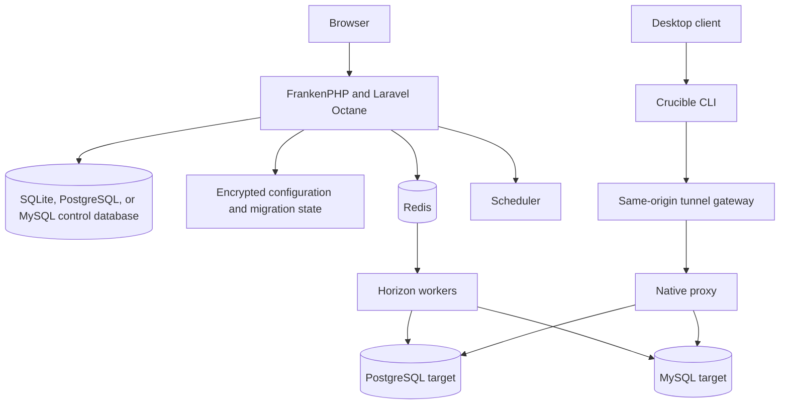

# Architecture

Crucible DB is a Laravel control plane with a React/Inertia application interface. It connects to target PostgreSQL and MySQL databases to test a connection, inspect schema, execute an authorized Deployment Batch or browser Query Access statement, and through the private Native proxy for approved desktop-client sessions.

## Components

| Component | Responsibility |
| --- | --- |
| Laravel + Inertia React | Application workflows, authorization, validation, and browser UI. |
| FrankenPHP + Octane | Long-running HTTP runtime. |
| Redis | Queues, Horizon metadata, sessions, and cache. |
| Horizon | Runs queued database operation jobs. |
| Scheduler | Dispatches due work and session-expiry tasks. |
| Control database | Application metadata in administrator-selected SQLite, PostgreSQL, or MySQL. |
| Persistent storage volume | Encrypted control-database selection and migration state, local SQLite data, logs, and application files. |
| PostgreSQL/MySQL targets | External governed databases reached only for authorized operations; they are separate from the control database. |
| Native proxy + CLI | Private protocol proxy and loopback-only client tunnel for approved Native client Query Access. |

## Long-running worker safety

Octane processes remain booted between requests. Application code must not retain user, authorization, request, or dynamic target-connection state in static properties or long-lived singletons. Deploying code or configuration changes requires restarting the application container so workers boot the current version.

## Current boundaries

- The supplied production topology has one application service. PostgreSQL or MySQL can move control data off the local SQLite file, but the encrypted selection and migration fence remain in shared persistent application storage and must stay consistent for every Laravel runtime.
- Redis is required; do not replace it with the metadata database for queues or sessions.
- Long-running target queries run in queued jobs, not HTTP workers.
- A control-database migration blocks normal web, queue, scheduler, and native-control mutations behind a maintenance fence until the restarted runtime confirms the selected database and an administrator finalizes the operation.
- Kubernetes deployment, service-account automation, table-level RBAC, and generic break-glass access are not current capabilities.

See [Native proxy architecture](../architecture/native-proxy.md) for protocol trust boundaries and lifecycle enforcement.
