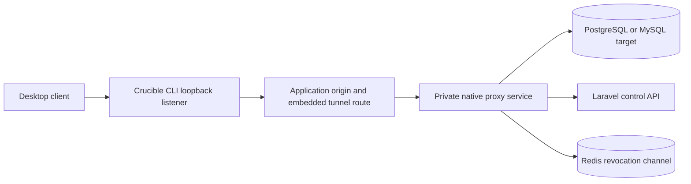

# Operate the Native proxy

The Native proxy is a separate, non-root Go service that implements private PostgreSQL and MySQL protocol listeners. It is reached only through the app origin's `/.well-known/crucible-native-client.json` discovery document and `/native-tunnel/*` WebSocket paths.

## Health and monitoring

The proxy exposes private `GET /healthz`, `GET /readyz`, and `/metrics` endpoints on its internal HTTP port. Liveness reports that the process is serving. Readiness is true only after an encrypted, HMAC-authenticated Laravel control-health request and a Redis ping both succeed; the check is repeated at `NATIVE_PROXY_READINESS_INTERVAL`. The public tunnel handler returns `503` while dependencies are unavailable.

During an application-database activation or rollback, the maintenance fence intentionally rejects native control requests. The proxy can therefore report not ready until the administrator finalizes the operation and releases the fence. This is expected; do not bypass the fence or expose a database port to restore readiness.

The metrics endpoint exposes the bounded `crucible_native_proxy_active_connections` gauge plus Go runtime and process collectors. Labels never contain a user, lease, connection, database, or SQL identifier. Per-connection byte counters, client application/version, CLI platform, upstream TLS verification, and privacy-safe statement counts are retained in the Laravel control-plane records rather than Prometheus labels. The Laravel scheduler checks readiness with a two-second bounded request and stores a short-lived snapshot. Dashboard health is cached and never performs a live proxy call during a user page request.

An unhealthy or version-mismatched result notifies operational recipients when the state changes. On the dashboard, the native-proxy icon immediately before the **CLI** link exposes readiness, reported version, instance count, active connection count, and the last check time in a hover and keyboard-focus panel. The indicator remains present before the first scheduler report or when a cached report expires; it never exposes credentials, SQL values, parameters, or result rows.

## Lifecycle behavior

Redis publishes immediate lease-revocation messages. Each proxy connection also calls the Laravel control plane heartbeat every two seconds. This durable heartbeat is the fail-closed backstop if Redis, a process, or a network path misses the immediate message. Laravel reconciles expired device approvals and reservations, stale active connections, and running statements every minute; it later removes expired, consumed, closed, revoked, and failed disposable state according to the configured retention window.

Control-plane requests carry an HMAC-authenticated request ID and AES-256-GCM encrypted body. Responses are encrypted too. Repeating the same authenticated mutation after an uncertain network failure replays the original encrypted response; reusing that ID for a different payload is rejected. Laravel also checks the configured proxy instance IDs and source IP allowlist. Upstream connection material is retrieved only through the separate post-reservation control endpoint, is never logged, and is sent only to the private proxy process.

Database sockets are closed after `NATIVE_PROXY_IDLE_TIMEOUT` without traffic. During shutdown, the service stops accepting new connections, reports not-ready, and permits active sessions to finish for `NATIVE_PROXY_DRAIN_TIMEOUT`; remaining sockets are then force-closed. Keep the container stop grace period longer than the drain timeout.

PostgreSQL prepared-statement portals retain their execution context across `PortalSuspended`, close upstream resources when replaced or disconnected, and preserve requested text or binary formats. The proxy still authorizes each actual execution and never persists bound values or result rows.

## Incident response

1. Revoke the affected lease from its Native client session, or end/cancel the Query Access session.
2. If scope is broader, deactivate the target connection or remove the user's role assignment; both revoke affected leases.
3. Review `native_proxy.*` audit events and session statement fingerprints.
4. Preserve logs and metadata, but redact device codes, bearer tokens, temporary passwords, SQL parameter values, and result data from incident material. Persisted statement templates replace string, dollar-quoted, prefixed, hexadecimal, bit, and numeric literals; upstream execution failures are stored as generic messages.
5. If the proxy is unavailable, do not expose target database ports as a workaround. Restore the private proxy or use a governed browser session/Deployment Batch.

## Backup and recovery

The proxy has no durable credential store. Its source of truth is the application database; Redis is used for immediate revocation and cache/queue operations. Back up the application storage and Redis using the normal [production procedure](production.md). After restoring, restart the app, Redis, and native proxy together so current lease state and workers are coherent. Restarting the app also restarts its embedded Caddy/FrankenPHP origin, Horizon workers, and scheduler.
