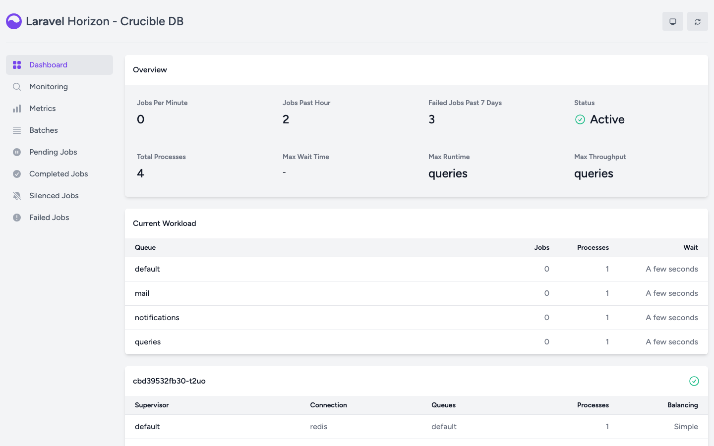

# Queues, workers, and schedules

Crucible DB separates HTTP requests, database execution, notifications, mail, and scheduled lifecycle work so long-running database operations do not occupy an Octane request worker.

## Runtime processes

The production application container uses Supervisor to keep three processes running:

| Process | Responsibility | Restart boundary |
| --- | --- | --- |
| Octane with FrankenPHP | Serves the Inertia application and HTTP endpoints. | Restart the container after code, environment, or configuration changes. |
| Horizon | Runs Redis-backed queue workers. | Supervisor restarts the process; deployments recreate the container. |
| Scheduler | Runs `schedule:work` and dispatches due lifecycle commands. | Supervisor restarts the process. |

## Queue separation

| Queue | Work | Current worker policy |
| --- | --- | --- |
| `queries` | Governed target-database execution. | One process, one attempt, 270-second timeout, recycled after 250 jobs or one hour. |
| `default` | General queued application work. | One process, one attempt, 60-second timeout. |
| `notifications` | In-app database notifications. | One process, three attempts, 60-second timeout. |
| `mail` | Optional email delivery. | One process, three attempts, 60-second timeout. |

All four queues use Redis. Query execution is deliberately isolated so email or notification work cannot execute SQL and query concurrency remains controlled.

## Scheduled lifecycle commands

Every minute, the scheduler runs:

- `crucible:dispatch-due-query-requests` to dispatch eligible scheduled work;
- `crucible:expire-query-sessions` to close expired browser Query Access windows;
- `crucible:expire-native-proxy-leases` to revoke expired native-client leases;
- `crucible:check-native-proxy-health` to refresh the bounded native-proxy readiness snapshot and notify operators if its state changes;
- `crucible:prune-native-proxy-state` to remove expired native-proxy state; and
- an independent system-status heartbeat plus `crucible:check-system-status` to publish the cached administrator System Status snapshot.

These scheduled tasks prevent overlap and use the single-server scheduler lock. The supplied Compose topology is single-node.

Application-database copy, activation, and rollback operations add a maintenance fence around these runtimes. The fence blocks normal web mutations, queued work, scheduled lifecycle mutations, and native-client control requests while the operation is in progress. It also waits for existing Query Access sessions, native leases/connections, and queued jobs to become idle before copying. The public `/health` endpoint and the administrator migration console remain available so an operator can verify and finalize the cutover.

When an activation or rollback reaches its restart step, restart every Laravel runtime so Octane, Horizon, and the scheduler load the same database configuration:

```bash
docker compose restart app worker scheduler
```

The production image runs all three processes in the `app` container, so production restarts only that service. See [Application database](../admin-guide/application-database.md) for the complete sequence.

## Horizon dashboard

{ .docs-screenshot }

The local development environment exposes `/horizon`. In non-local environments, the shipped Horizon gate contains no authorized email addresses, so the dashboard is denied by default. Deliberately configure `App\Providers\HorizonServiceProvider` before exposing it in production, and restrict access to trusted operators.

Useful checks inside the production application container include:

```bash
php artisan horizon:status
php artisan schedule:list
php artisan crucible:check-system-status
```

The administrator [System Status](../admin-guide/system-status.md) page exposes the most recent bounded checks without initiating infrastructure probes during a browser request. It is diagnostic only: it cannot restart processes, clear queues, or control Docker.

Horizon retains recent completed jobs for 60 minutes and failed jobs for seven days. Queue wait thresholds are 60 seconds for `queries`, `default`, and `notifications`, and 120 seconds for `mail`. Metrics require scheduled `horizon:snapshot`; the current Crucible scheduler does not schedule snapshots, so do not rely on historical Horizon metric graphs without adding that deliberate operational task.

## Long-running worker safety

Octane workers hold the booted application between requests. Crucible code must not retain users, authorization, request data, or dynamic target connections in static state or long-lived singletons. The production command recycles each Octane worker after 500 requests by default; `OCTANE_MAX_REQUESTS` can change that boundary.
