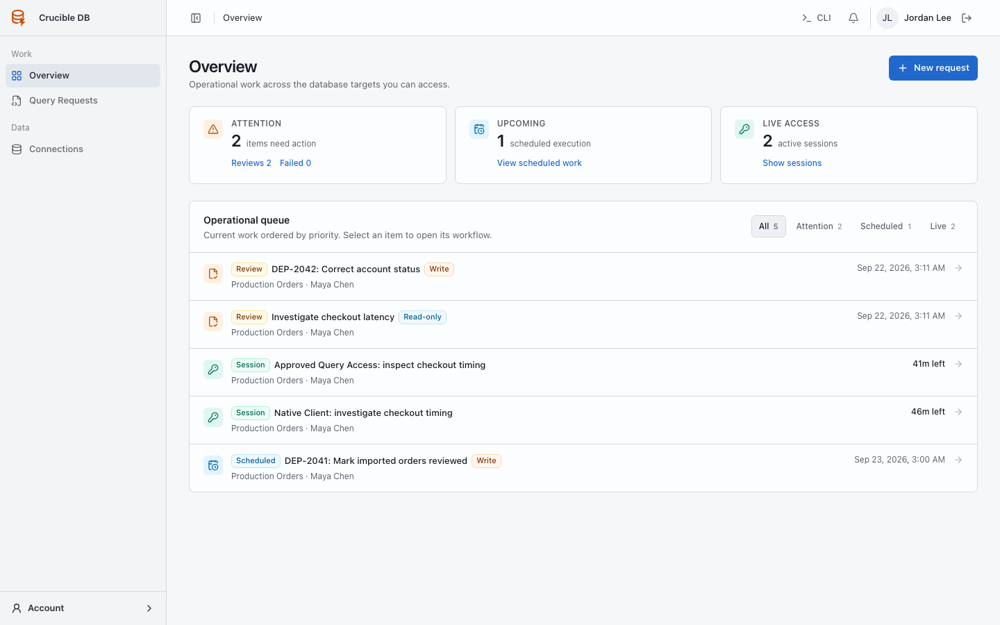
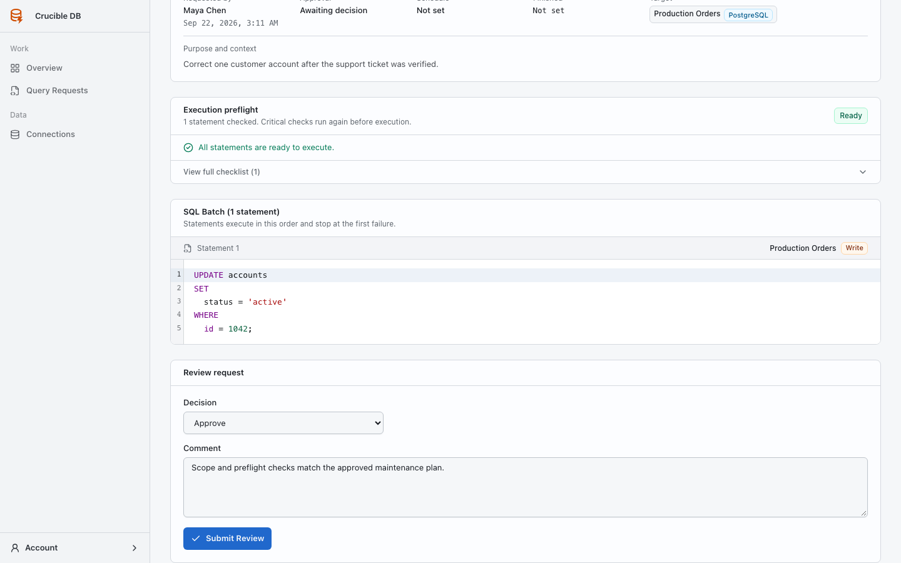
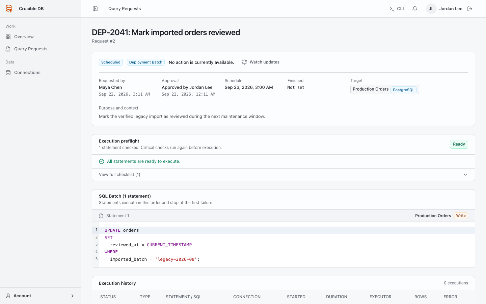

# Approval flow

Approval is a recorded decision on a specific request scope. It does not bypass later SQL, target, policy, schedule, or session checks.

## 1. Open pending work

Open the **Attention** view in the Overview operational queue. Requests that need an authorized decision carry a **Review** tag and remain scoped to the connections you may review.

{ .docs-screenshot }

## 2. Inspect the request

Open the request and verify its requester, targets, statement order or Query Access scope, requested level, schedule, and current preflight.

{ .docs-screenshot }

## 3. Record the decision

In **Review request**, select **Approve** or **Reject** and add a concise comment that explains the decision. The requester cannot review their own work.

{ .docs-screenshot }

## 4. Confirm the resulting state

An approved scheduled batch waits for its requested time. An overdue scheduled batch requires explicit dispatch instead of running late. Rejection prevents execution and records the reason.

{ .docs-screenshot }

## 5. Follow execution

Approval is not the final safety check. Deployment preflight runs again before dispatch. Query Access enforces the approved level and current policy for every statement. Watch the request when the outcome requires follow-up.
