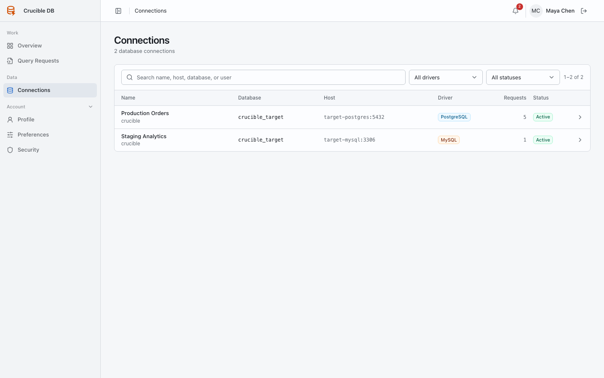
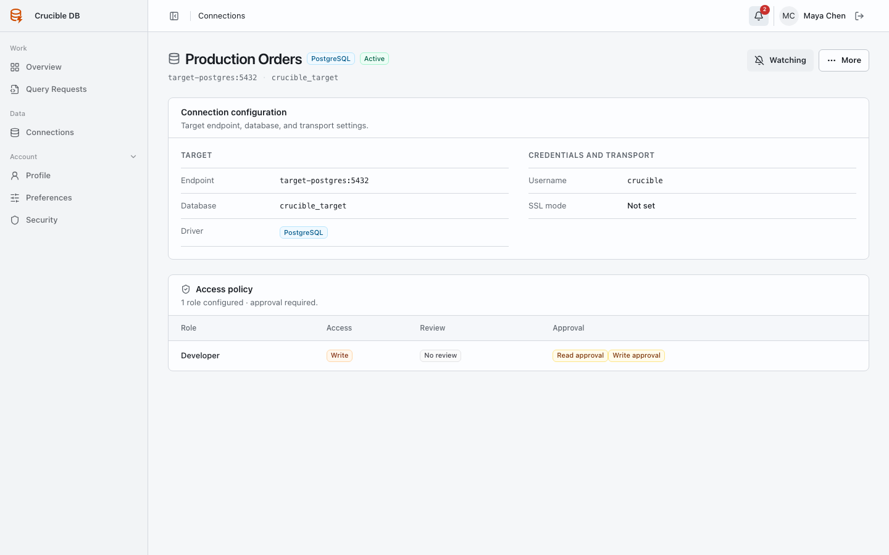

# Connections menu

**Who sees it:** every signed-in user. Ordinary users see only connections allowed by effective role policy. Administrators see and manage all connections.

{ .docs-screenshot }

## Understand a connection

Each connection identifies a target database, driver, activity state, and health context. Open a connection to see details that are safe for your role. Stored credentials are never displayed.

{ .docs-screenshot }

The detail page shows the host endpoint, database name, transport settings, and connection-specific role assignments. Group policy remains visible through Access Roles. Ordinary users cannot test or edit configuration. Administrators receive **Test connection** and **Edit** actions.

## Use a connection

A visible connection can be selected only within the access permitted by your effective policy. Deployment access and Query Access capability are evaluated separately.

Use **Watch updates** on important connections to receive relevant operational notifications. Watching does not grant additional permission.

Connection tests validate reachability with the stored encrypted credential. A failed test creates operational notification and audit context; a successful test does not change role policy.

## Administrator actions

Administrators can create, edit, test, activate, deactivate, and delete connections where lifecycle constraints permit it. See [Manage connections](../admin-guide/connections.md).
