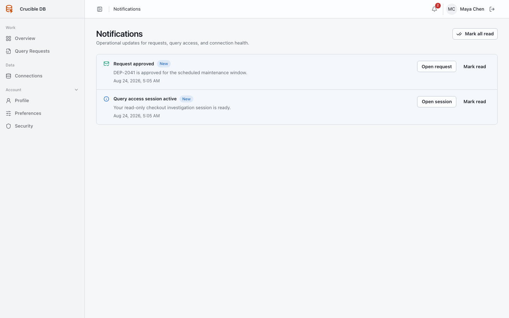
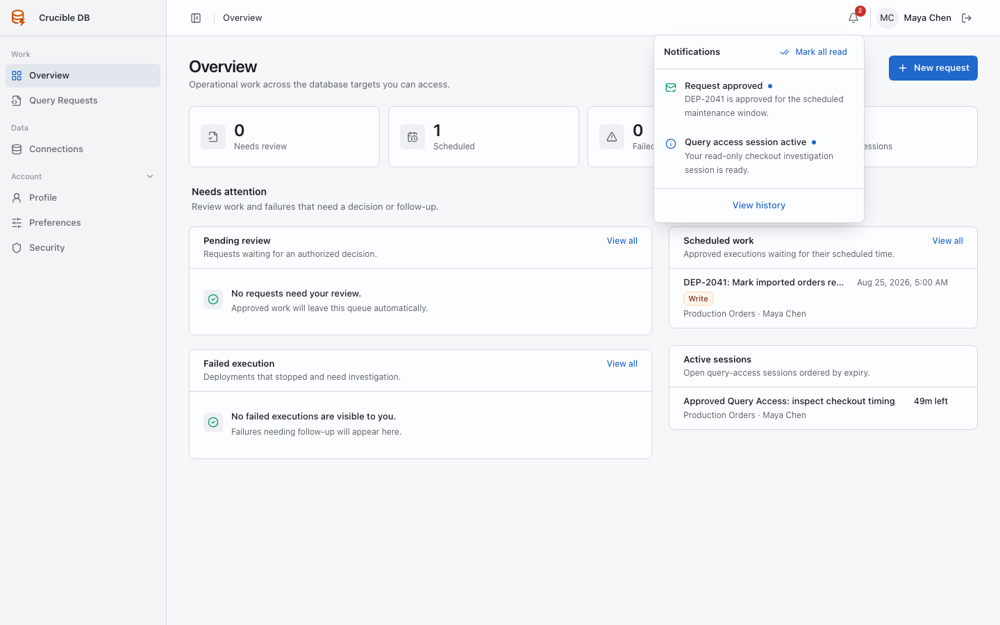

# Notifications

**Who sees it:** every signed-in user.

Notifications keep review, execution, session, cancellation, retry, and connection events close to the affected work.

{ .docs-screenshot }

## Notification bell

The top-bar bell shows unread count and recent items. Open an item to go directly to its request, session, or connection. Use **Mark all read** only after reviewing the outstanding items.

{ .docs-screenshot }

Severity is expressed with text and iconography in addition to colour. Marking an item read changes notification state only; it does not acknowledge, approve, dispatch, or cancel the underlying operation.

## Notification history

Select **View history** from the bell to open the complete notification page. Each notification includes severity, message, timestamp, read state, and a contextual action.

## Email delivery

Email requires both workspace email delivery and your individual preference to be enabled. In-app notification history remains the primary product record. Audit records remain separate and authoritative for meaningful actions.
