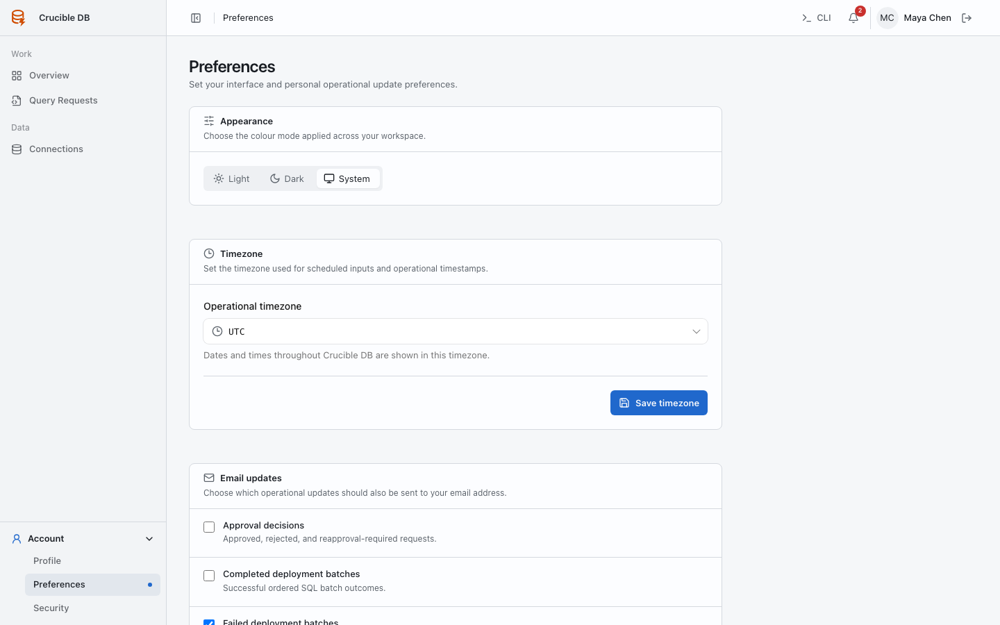

# Preferences

**Who sees it:** every signed-in user under **Account → Preferences**.

{ .docs-screenshot }

## Appearance

Choose **Light**, **Dark**, or **System** colour mode. System follows the operating system preference. The selection changes presentation only.

## Timezone

Choose the personal operational timezone used to display dates and times and interpret scheduled query inputs. New accounts start with the workspace default configured by an administrator, and each user can override it here.

## Email updates

Choose which eligible approval decisions, completed batches, failed batches, Query Access events, and failed connection tests may also be delivered by email. Workspace notification policy and SMTP configuration can disable delivery globally or by event type.

## Watched resources

Review the requests and connections you watch. Remove a subscription when the work no longer needs special attention.
