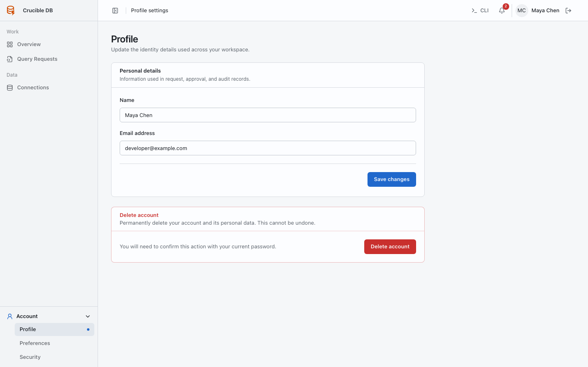

# Profile

**Who sees it:** every signed-in user under **Account → Profile**.

{ .docs-screenshot }

Use Profile to maintain your displayed name and account email. Your identity appears in request, review, execution, notification, and audit context, so keep it recognizable to your team.

## Personal details

- **Name** identifies you throughout governed work and audit history.
- **Email address** is the password-login identity and notification destination.

Set the timezone used for scheduled inputs and operational timestamps under [Preferences](preferences.md).

Changing identity information does not change database permissions. Administrators assign roles separately under **People**.

## Delete account

The destructive section on Profile permanently removes your personal account after current-password confirmation. Do not use deletion as a substitute for administrator disablement when the organization must preserve ownership and access history. Coordinate account lifecycle with a workspace administrator before proceeding.
