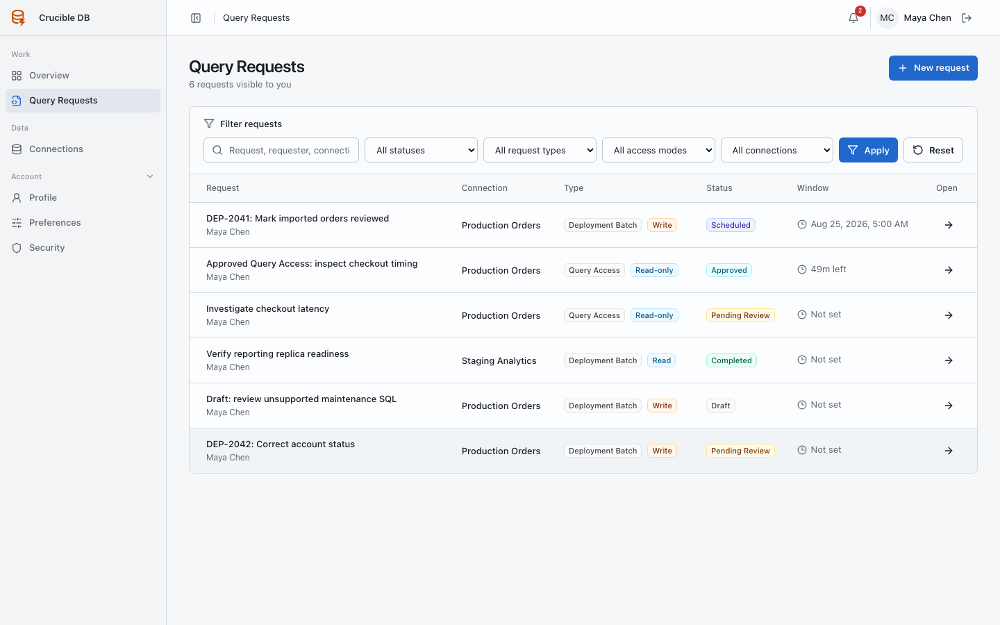

# Query Requests menu

**Who sees it:** every signed-in user with access to at least one governed connection. Administrators can view workspace-wide requests; ordinary users see requests allowed by their target scope.

{ .docs-screenshot }

## Find work

Use the search and filters to narrow requests by workflow, status, requester, or target when those filters are available to your role. Status labels distinguish draft, review, schedule, execution, and terminal states.

## Open a request

The request detail page is the source of truth for:

- requester and target scope;
- ordered statements or Query Access connections;
- requested access level and duration;
- preflight status and findings;
- review decisions;
- schedule and dispatch state;
- execution or session results;
- cancellation and retry lineage; and
- watch status and audit context.

Completed executions can offer **Export CSV** when recorded rows are available. Exports are generated from the stored governed execution result and remain subject to request authorization. A result count ending in `+` indicates truncation; the source query may have returned more rows than Crucible retained.

Editing approved work invalidates the previous approval when the executable scope changes. The updated request returns to the appropriate review state.

## Start a request

Select **New request**, then choose:

- **Deployment Batch** for known SQL that should be reviewed as an ordered unit.
- **Query Access** for a temporary browser session whose level and targets are approved before queries run.

Use [Deployment batches](../guides/deployment-batches.md) or [Request Query Access](../guides/query-access.md) for the complete workflows.
