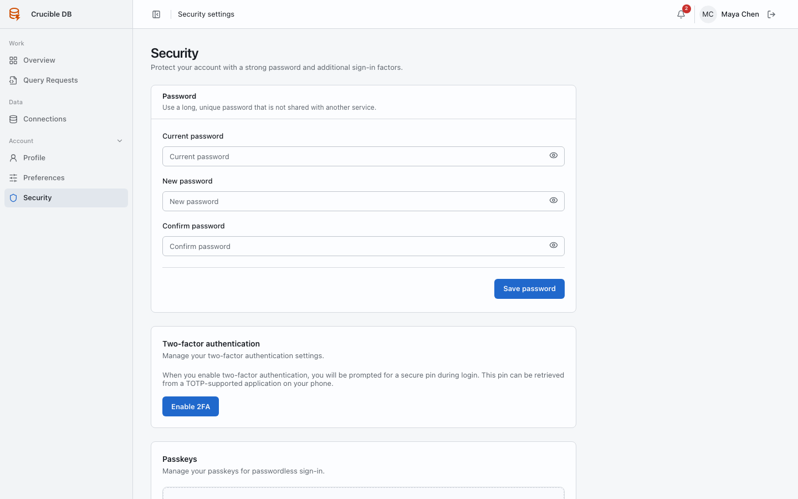

# Security

**Who sees it:** every signed-in user under **Account → Security**.

{ .docs-screenshot }

## Password

Use a unique password and your organization's approved password manager. Sensitive account changes may require recent password or passkey confirmation.

## Two-factor authentication

Enable two-factor authentication, confirm the generated authenticator code, and store recovery codes in an approved secure location. Recovery codes are credentials and must never appear in tickets or documentation screenshots.

## Passkeys

Register passkeys only on devices you control. A passkey can satisfy protected confirmation flows supported by the application.

You can rename or remove registered passkeys from this page. Keep at least one working sign-in method before removing a passkey.

Account deletion belongs to [Profile](profile.md), not Security.
