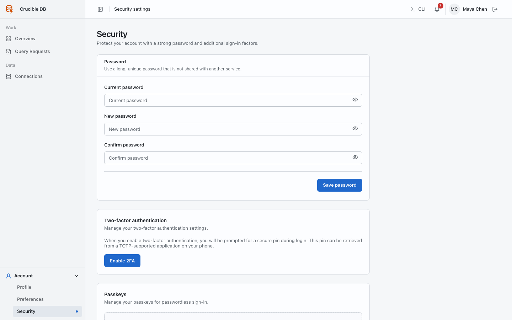

# Security

**Who sees it:** every signed-in user under **Account → Security**.

{ .docs-screenshot }

## Password

Use a unique password and your organization's approved password manager. Sensitive account changes may require recent password, passkey, or linked SSO confirmation.

## Two-factor authentication

Enable two-factor authentication, confirm the generated authenticator code, and store recovery codes in an approved secure location. Two-factor authentication protects email-and-password sign-in; your identity provider protects an SSO sign-in. Recovery codes are credentials and must never appear in tickets or documentation screenshots.

## Passkeys

Register passkeys only on devices you control. A passkey can satisfy protected confirmation flows supported by the application. If your account only uses SSO, confirm through its linked provider when registering your first passkey.

You can rename or remove registered passkeys from this page. Keep at least one working sign-in method before removing a passkey.

Account deletion belongs to [Profile](profile.md), not Security.
